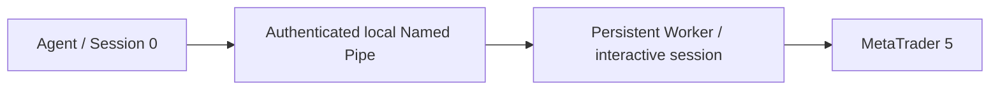

# MT5 Agent

MT5 Agent is a Windows control-plane application that exposes a bounded local
HTTP command interface and coordinates read-only MetaTrader 5 operations. In
the supported Windows runtime, the Agent runs in Session 0 and communicates
with a persistent Worker in a separate interactive user session. The Worker,
not the Agent, owns the MetaTrader5 Python runtime and `terminal64.exe`.

The current safe MT5 reads are symbols total, terminal version, and account
information. Account values are operationally sensitive and must not be copied
into logs or documentation examples. No trading operation is production-ready
or included in the release smoke gate.

## Architecture and status

The split-session Worker path and unattended lab cold-boot bootstrap are
**LAB VALIDATED**. MT5 Agent v0.1.3 was released from tag `v0.1.3` at commit
`970c04712853295fd065094b11a2bd541b5a9db8` on 2026-10-06. Release Pipeline #16
passed all eight gates. Pipeline #17 separately validated the `develop` commit
`2e01ff78c447d5242e0d582944c43f0d952b3446`; its first MT5 runtime smoke failed
and a later execution succeeded, with the initial failure cause still unknown.
See the [release acceptance and provenance](docs/releases/v0.1.3-release-notes.md),
[Pipeline #11 historical acceptance](docs/evidence/v0.1.3/phase4d-live-ci-acceptance.md),
and [post-release validation](docs/evidence/v0.1.3/post-release-validation.md).
See [Architecture](docs/ARCHITECTURE.md) and [Action Plan](docs/ACTION_PLAN.md).

## Development and dependencies

The control-plane package has no third-party runtime dependency and does not
install MetaTrader5 or NumPy. Use `requirements-dev.txt` for source tests and
build tooling. The interactive Worker has its own pinned Windows dependency
set; direct in-process MT5 support is isolated in the explicit legacy
requirements file. See [Configuration](docs/CONFIGURATION.md).

Portable source tests run on Linux. Windows no-MT5 CI validates the clean Agent
build and degraded control plane. A separate Windows MT5 Runner validates the
same candidate against the persistent Worker. The release invariant is:

> **BUILD ONCE → TEST SAME ARTIFACT → RELEASE SAME ARTIFACT**

Pipeline #16 verified the released candidate through build, control smoke,
runtime, and packaging without a post-smoke rebuild. Pipeline #11 remains a
separate historical acceptance record. See [CI/CD](docs/CI.md),
[Release Process](docs/RELEASE_PROCESS.md), and the
[v0.1.3 release notes](docs/releases/v0.1.3-release-notes.md).

## Documentation

The repository is the canonical, versioned product documentation. The
[documentation index](docs/README.md) organizes architecture, deployment,
security, operations, CI, testing, release, roadmap, and troubleshooting
material. Start with:

- [Runtime architecture](docs/MT5_RUNTIME_ARCHITECTURE.md)
- [Runtime provisioning](docs/MT5_RUNTIME_PROVISIONING.md)
- [Operations runbook](docs/OPERATIONS.md)
- [Troubleshooting](docs/TROUBLESHOOTING.md)
- [Action Plan](docs/ACTION_PLAN.md)
- [Known issues](docs/KNOWN_ISSUES.md)
- [Changelog](CHANGELOG.md)

## Desktop and setup status

The v0.1.5 development branch builds a unified internal Windows Setup
(`MT5Agent-Setup-v0.1.5-windows-x64.exe`) containing the Desktop, Python Agent,
Service host, and bundled Python MT5 Worker. See
[installer design, setup, and CI artifact instructions](deployment/installer/README.md).
The package is not a public release: live install/upgrade/repair/uninstall
validation in a disposable Windows 10 VM remains outstanding, and the Worker
requires a separately configured standard interactive account and MT5 profile.
No trading operation is included. MT5Agent must not manage BitLocker, TPM,
Secure Boot, or recovery keys; those remain the machine owner's responsibility.
