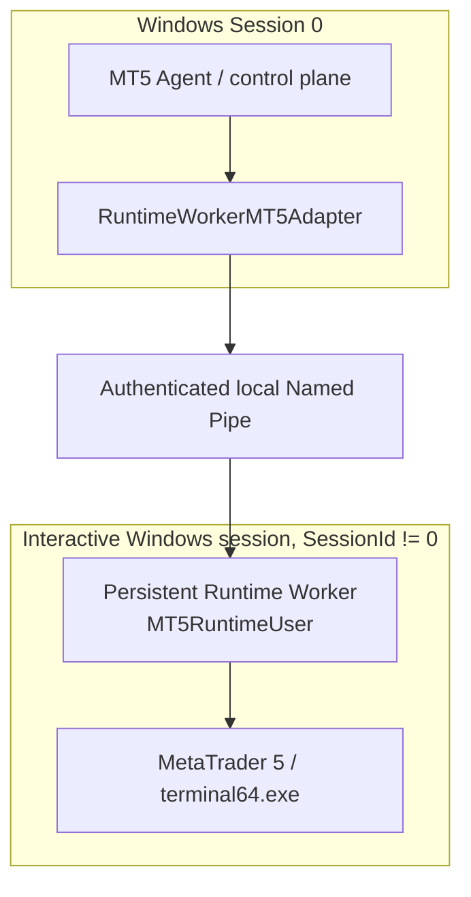

# Architecture

**Baseline:** released v0.1.3. The split-session Runtime Worker is implemented
and lab validated. Release Pipeline #16 accepted the tagged artifact; Pipeline
#17 later validated the `develop` revision. Pipeline #11 remains historical
Phase 4D candidate evidence in the
[original acceptance record](evidence/v0.1.3/phase4d-live-ci-acceptance.md).
The initial runtime smoke failure in Pipeline #17 has an unknown cause and
does not establish general Worker startup reliability; see
[post-release validation](evidence/v0.1.3/post-release-validation.md). CI
acceptance is distinct from commercial production readiness; see [CI](CI.md)
and [Action Plan](ACTION_PLAN.md).

## Runtime boundary

The supported Windows production path keeps the Agent/control plane separate
from MT5's interactive user session:

On Windows, `agent.composition._default_mt5_adapter()` selects
`RuntimeWorkerMT5Adapter`. It reads machine-local runtime configuration and
requires the control process to be in Session 0. The Session 0 Agent does not
import MetaTrader5 or call its API. `MT5Port` keeps application code independent
of the IPC implementation. The Worker is the sole owner of the persistent
MetaTrader5 Python API connection and performs allowlisted operations in its
interactive session.

The Worker uses protocol version 1, bounded JSON messages, request IDs, response
correlation, an explicit operation allowlist, and replay-window checks. Windows
pipe ACL authorization is restricted to the SID resolved from configured
`ControlPrincipal`; remote pipe clients are rejected and the Worker also checks
the client SessionId is 0. The server does not impersonate the caller. This is
account-level authorization: every process running as the configured control
principal can access the endpoint.

The primary safe MT5 reads are `mt5.get_symbols_total`,
`mt5.get_terminal_version`, and `mt5.get_account_information`. The current
`mt5.get_terminal_information` command returns a sanitized runtime-health
projection; it is not a separate arbitrary Worker API call. No trading command
is enabled or represented as production-ready.

## Lifecycle and readiness

The Agent stays alive when the interactive runtime or pipe is unavailable.
Startup attempts the Worker connection and may remain `AGENT_RUNNING` with
health degraded. The adapter uses bounded timeouts and retry backoff. A healthy
Agent process alone does not mean MT5 is ready: readiness requires an available,
authenticated Worker and live `MT5_CONNECTED` health. The Worker initializes
MT5 on request, keeps the API connection between normal requests, serializes
operations, and owns bounded recovery. Detaching or stopping the Agent client
does not stop the persistent Worker or terminal.

## Boot and session model

The lab-validated bootstrap is a standard local `MT5RuntimeUser` automatic
interactive logon, followed by an `AtLogOn` Scheduled Task using an interactive
token. The persistent Worker and terminal run in that nonzero session. The
Session 0 Agent discovers readiness through IPC rather than relying on a fixed
startup delay. RDP disconnect is not logoff; explicit logoff destroys the
interactive runtime, after which the Agent remains alive and reports degraded
health. See [runtime provisioning](MT5_RUNTIME_PROVISIONING.md).

**Lab validated:** cold reboot without RDP/console login created the runtime
session, started the Worker, authenticated Session 0 IPC, initialized MT5,
confirmed connectivity, and completed safe reads. This proves the lab topology,
not a signed installer or a general customer VPS support commitment.

## Dependency and artifact boundary

The control-plane Agent has no production MetaTrader5 or NumPy runtime
dependency. The PyInstaller Agent candidate excludes MetaTrader5, NumPy, the
interactive Worker implementation, the legacy direct `MT5Adapter`, and
`terminal_inspection`. Recursive archive inspection passed in Pipeline #16;
the earlier candidate was also inspected in Pipeline #11. The
Worker uses its separate pinned dependency set. A direct adapter remains only
for explicit development/legacy and compatibility test use. See
[configuration](CONFIGURATION.md), [CI](CI.md), and [release process](RELEASE_PROCESS.md).

## Product scope and status

Implemented application capabilities include health/status and the safe MT5
reads listed above. There is no production trading, order placement, position
management, Kafka-backed command ingestion, or customer installer/service
provisioning in this baseline. SQLite, remote configuration, transport, and
security modules documented elsewhere are foundations unless explicitly wired
into the production composition; their presence alone does not mean they are
active in the Agent request path.

The current process can run as a Session 0 control process, but a commercial
Windows Service installer, service recovery policy, signed upgrade flow, and
generalized customer provisioning are not yet accepted. Do not describe the
product as commercially production ready until those remaining gates pass;
Phase 4D live CI acceptance alone does not productize installation or support. See [known issues](KNOWN_ISSUES.md) and [Action Plan](ACTION_PLAN.md).
