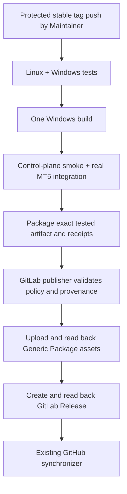

# GitLab Release Publication and GitHub Synchronization

**Architecture:** GitLab is the only release source of truth. A Maintainer's
intentional creation of a protected stable semantic-version tag is the release
trigger. The tag pipeline runs every required CI gate, publishes the exact
tested artifact to the GitLab Generic Package Registry and GitLab Release, then
invokes the existing one-way GitHub synchronizer. GitHub remains downstream.

**Implementation status:** the protected `v*` tag rule and protected,
masked/hidden `GITHUB_RELEASE_TOKEN` were observed in GitLab project settings
on 2026-10-08. The sync and publisher code and local fake-API tests are present.
The effective write access of a pipeline `CI_JOB_TOKEN`, the installed GitLab
CI configuration, and a complete real publication have not been verified by a
release run. Therefore, do not describe the end-to-end publishing path as
operational until an authorized tag pipeline completes all read-back checks.
No test release/tag/package was created to exercise the new publisher.

## Audited inventory (2026-10-08)

GitLab had one Release, `v0.1.3`, at
`970c04712853295fd065094b11a2bd541b5a9db8`. It exposed four generated source
archives and four manually linked Generic Package files, plus a
`mt5-agent/0.1.3` package. Package metadata reported the executable as
8,124,497 bytes with SHA-256
`175ff421e06d0c7394721dcf2aaa9509b953bc3d9c3d8d7f6fab7afb01e4ab28`; the
read-only audit environment could not independently download its bytes.

At the initial audit, GitHub had eight published releases, `v0.0.2` through
`v0.0.9`, and no `v0.1.3` Release. Those GitHub-only releases are retained
unchanged. Historical checksum conflicts were observed for `v0.0.2`, `v0.0.4`,
and `v0.0.6`; this workflow does not edit or delete those releases or assets.
See the [GitHub Releases page](https://github.com/AmirrezaSobhi/agent/releases).

**Post-release reconciliation (2026-10-08):** GitLab Pipeline #29 on `main`
at `adbc4be618db8b3f8602987408cd3a5df01a500b` was a web pipeline. Its optional
`release:github-reconcile` Job #231 completed successfully. GitHub now has a
published `v0.1.3` Release targeting `970c04712853295fd065094b11a2bd541b5a9db8`
with the four official assets. GitHub asset metadata reports the executable as
8,124,497 bytes with SHA-256
`175ff421e06d0c7394721dcf2aaa9509b953bc3d9c3d8d7f6fab7afb01e4ab28`, matching
GitLab's package/release metadata. Git branch refs also match. This confirms
the manual reconciliation path for v0.1.3; it does not exercise the new
automatic protected-tag publisher/synchronizer path.

The existing GitLab push mirror to GitHub was enabled and reported its last
observed status as `finished`. It is not changed by this workflow. No release
webhook receiver is required: the GitLab tag pipeline starts the publisher
only after all CI gates and package evidence succeed.

## Publication policy and dependency graph



`.gitlab-ci.yml` has `release:gitlab-publish` after `package:windows` and
`release:github-sync` after the publisher. The package job's transitive
`needs` chain requires Linux source tests, Windows tests, the one-time Windows
build, invalid-configuration smoke, degraded control-plane smoke, and the
interactive real-MT5 integration. The publisher downloads that package job's
artifacts; it never rebuilds the executable. Ordinary branches and merge
requests cannot run publication jobs. Release jobs require a stable semantic
tag and `CI_COMMIT_REF_PROTECTED=true`.

The pre-tag authorization record binds to version/tag/full commit SHA and the
reviewed MR, not a future pipeline ID that cannot exist before tag creation.
Pipeline reuse is prevented by allowing publication only in the protected
tag's `push` pipeline: retries retain that pipeline ID, while web, scheduled,
API, and merge-request pipelines fail both publisher and sync source checks.
The sync script additionally pins the automatic path to project `1` /
`root/agent`. All build
and acceptance receipts must match that current pipeline ID.

The publisher also requires a push pipeline, project ID/path `1` / `root/agent`,
a tag that resolves exactly to `CI_COMMIT_SHA`, and proof that the commit is
reachable from `main` using the GitLab commit-refs API. This is separate from
the tag name check. The current GitLab configuration was observed to protect
`main` and to restrict creation under `v*` to Maintainers. These controls must
remain in force.

Before the tag is created, exact versioned release notes and
`docs/releases/vX.Y.Z-authorization.json` must be on the tagged main commit.
The record binds the tag and full commit SHA to a numeric Release Owner user ID,
approval timestamp, merged-MR reference, and a disposition for every known
release-blocking risk. `MT5_RELEASE_OWNER_USER_ID` must be configured as a
protected GitLab CI/CD variable. The publisher requires that ID to match the
record and differ from `GITLAB_USER_ID`, the protected-tag creator. It also
reads the referenced MR with `CI_JOB_TOKEN` and requires it to be merged into
`main`. KI-009 is explicitly required and needs the same Release Owner approval
and MR reference whether marked accepted or resolved.

GitLab's CI job token allows reading an MR but does not expose the MR approvals
API. The publisher therefore cannot independently prove that the configured
Release Owner approved the MR. A Maintainer/release reviewer must verify the
actual GitLab approval and risk decision before creating the protected tag;
the protected owner ID, distinct tag actor, merged-main MR, and tag/commit-bound
record provide the strongest enforceable alternative available without a new
long-lived credential or approval service. This limitation is a blocker to
first production publication until the owner ID and approval review procedure
are configured and exercised.

Authorization record shape (create one for each version; do not add a sample
record for a real release before its exact main commit and approvals exist):

```json
{
  "schema_version": 1,
  "tag": "vX.Y.Z",
  "commit_sha": "<full commit SHA>",
  "approved_by_user_id": 23,
  "approved_at": "<ISO-8601 timestamp with timezone>",
  "approval_reference": "https://gitlab.local/root/agent/-/merge_requests/<iid>",
  "release_blocking_risks": [
    {
      "id": "KI-009",
      "disposition": "accepted",
      "reference": "https://gitlab.local/root/agent/-/issues/9",
      "approved_by_user_id": 23,
      "approved_at": "<ISO-8601 timestamp with timezone>",
      "approval_reference": "https://gitlab.local/root/agent/-/merge_requests/<iid>"
    }
  ]
}
```

## Current-pipeline evidence and asset contract

`tools/release_sync/gitlab_release_publish.py` checks the build, control-plane,
runtime, and package receipts for the current pipeline, commit, version,
filename and executable SHA-256. It checks build-once/no-rebuild and archive
inspection evidence; control-plane degraded health; MT5-connected final health;
safe-read success; and the Worker/terminal session and identity relationships.
Only sanitized facts are included in `release-acceptance.md`; account values,
Windows SIDs, principal names, and private runtime paths are not copied into
the public release notes or acceptance file. Historical v0.1.3 acceptance
receipts cannot be reused for another binary.

Each release has exactly these four official assets:

| Asset | Source and verification |
|---|---|
| `MT5Agent-vX.Y.Z.exe` | Exact `package:windows` executable; size and SHA-256 checked against all receipts |
| `SHA256SUMS.txt` | Standard SHA-256 lines for the executable, notes, and generated acceptance file |
| `release-notes.md` | Exact non-empty `docs/releases/vX.Y.Z-release-notes.md` from the tagged commit |
| `release-acceptance.md` | Generated from current-pipeline receipts and job dependencies |

Files are uploaded to `mt5-agent/X.Y.Z` in Generic Packages and downloaded
again for independent size/hash verification. The GitLab Release, including
all four package links, is created only after all package files are verified.
The Release is read back and compared. `release-acceptance.md` is generated
from CI evidence; test counts, runtime details, approvals, and timestamps are
never fabricated.

## Idempotency, immutability, and recovery

- Missing package: create the version and upload verified assets.
- Partially uploaded package: verify existing files and upload only missing
  names. A retry never overwrites an existing file.
- Existing matching asset: download and verify exact bytes; reuse it.
- Duplicate package version, unexpected file, or conflicting bytes: stop.
- Existing exact Release: verify metadata, target commit and complete asset
  links, then exit without mutation.
- Existing conflicting Release or tag target: stop; never update, delete, or
  force-move it.
- Transient GET/PUT/POST response: bounded network retries. If Release creation
  response is ambiguous, read the Release by tag and verify it before deciding
  whether it succeeded. Release creation is the last publication mutation.
- After an ambiguous package upload, the publisher reads the Registry before
  retrying. Matching bytes are reused; conflicting bytes stop the job.
- A failed publisher fails the pipeline; GitHub sync cannot start. Resolve the
  stated issue and retry the same failed job in the same tag pipeline. Do not
  create another tag to retry.
- A package may be partially populated after a failed upload. It is not linked
  to a public Release until all files pass read-back verification. Retry uses
  the same tag/pipeline inputs and resumes only non-conflicting missing files.
- Do not repair conflicting historical Releases or assets automatically.
  Escalate for a separately approved recovery plan; preserve history and
  artifacts.

## Authentication and operator configuration

The publisher uses only the masked `CI_JOB_TOKEN` with GitLab's `JOB-TOKEN`
header. It needs reads for tags, commit refs, authorization MRs, package
inventory/files, downloads, and Release lookup (`READ_REPOSITORIES`,
`READ_MERGE_REQUESTS`, and `READ_PACKAGES`), package writes
(`ADMIN_PACKAGES`), and Release creation (`ADMIN_RELEASES`) when
fine-grained permissions are enabled. GitLab's documented endpoint permissions
do not prove the running job's effective permissions. Project settings
currently show default permissions inherited
from the triggering user's role and project membership; the same-project job
token write path has not been exercised. The first authorized Maintainer tag
pipeline will verify the actual access. If it fails with 401/403, do not add a
PAT or project token silently: review the exact minimum GitLab job-token
permissions and configure them through the approved project process, then
retry.

Both publisher and GitHub synchronizer now reject non-HTTPS GitLab API URLs,
and credentials are stripped on any redirect that changes scheme or host.
The previously observed `CI_API_V4_URL` is `http://gitlab.local/api/v4`, so the
current installation will fail closed until GitLab is configured with TLS and
the Runner receives the trusted certificate. Do not weaken the HTTPS check or
send `CI_JOB_TOKEN` over HTTP.

The existing `GITHUB_RELEASE_TOKEN` is present as protected, masked and hidden.
The GitHub synchronizer retains its existing tag-target checks, no-overwrite
behavior, GitHub asset digest/size checks, public-download verification, and
credential-stripping redirect handler. Keep the fine-grained token scoped to
`AmirrezaSobhi/agent` with Contents: write, or use an already approved GitHub
App installation flow. The GitLab mirror's SSH credential is not used for
GitHub Release API writes.

Relevant API permissions and authentication are documented by GitLab:
[CI job token fine-grained permissions](https://docs.gitlab.com/ci/jobs/fine_grained_permissions/),
[Generic Packages](https://docs.gitlab.com/user/packages/generic_packages/),
[Releases API](https://docs.gitlab.com/api/releases/), and
[CI job token](https://docs.gitlab.com/ci/jobs/ci_job_token/).

## Existing GitHub reconciliation

`release:github-reconcile` remains an optional protected-branch manual job for
an already published GitLab Release whose tag pipeline predates the sync job.
It uses the existing `tools/release_sync/github_release_sync.py`, validates an
explicit tag and expected commit, waits a bounded time for the mirrored tag,
and syncs only source GitLab Release metadata/package assets. It is not the
normal future-release path and it does not create GitLab Releases. GitHub-only
historic releases and conflicting metadata/assets are preserved.

The script's `--dry-run` remains a read-only GitHub inventory operation. The
new GitLab publisher's `--dry-run` validates the full current-pipeline input
and performs only API reads; it never uploads files or creates a Release.
Neither dry-run validates an actual job token's write permission. Unit tests
use in-memory API fakes and do not publish.

## Local validation

```sh
python3 -m pytest -q tests/test_gitlab_release_publish.py tests/test_github_release_sync.py tests/test_ci_topology.py
python3 -m compileall -q tools/release_sync
```

No test or dry-run may create a tag, package version, or Release in either
remote. The first real publication must be an intentionally authorized,
protected stable tag pipeline after CI configuration validation and approval
review.
