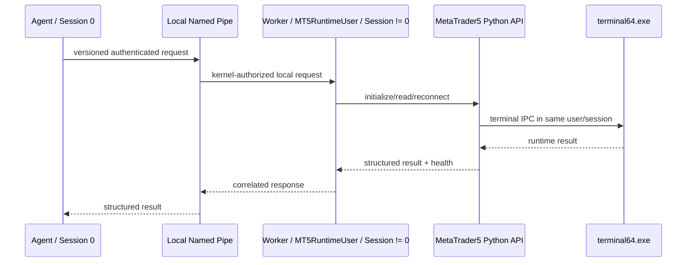

# MT5 Runtime Architecture

**Status:** IMPLEMENTED; LAB VALIDATED; LIVE CI ACCEPTED in
[Pipeline #11](evidence/v0.1.3/phase4d-live-ci-acceptance.md). This describes the runtime boundary,
not a general-purpose installer. Operational setup is in
[MT5 Runtime Provisioning](MT5_RUNTIME_PROVISIONING.md).

## Process and session ownership

On Windows, `compose_agent()` selects `RuntimeWorkerMT5Adapter`; the adapter
implements the existing `MT5Port`. The Agent does not import MetaTrader5 in
its production path. The Worker imports MetaTrader5 and is the exclusive owner
of API initialization, serialized operations, connection state, bounded
recovery, and API shutdown. `mt5.shutdown()` is not issued after each normal
request. Shutting down the API does not imply termination of the terminal
process.

The Agent process must be in Session 0 for the production Windows adapter.
The Worker must report the configured principal and a nonzero session. The
terminal owner SID and SessionId must match the Worker when process identity is
available. A username match without a session check is insufficient.

## IPC trust boundary

The local endpoint is a Windows named pipe with remote clients rejected. Its
DACL grants access to the SID resolved from configured `ControlPrincipal`.
Windows evaluates the connecting process token against the pipe ACL. The
Worker obtains the connected client's SessionId from the pipe and requires
Session 0. It does not use client-supplied identity claims, impersonation, or
`SeImpersonatePrivilege`. Authorization is by Windows account SID, not by
individual process; all processes under that control identity are within the
trust boundary.

Protocol version, operation allowlist, request IDs, correlation, bounded
message framing, and a bounded duplicate/replay window are validated. Unknown
operations fail closed. The pipe is not exposed over TCP. The current protocol
supports health/handshake, initialization/reconnect, safe reads, explicit
runtime shutdown, and Worker shutdown. Production application calls use
application-level methods rather than raw protocol dictionaries.

## Health meanings

Agent process liveness and MT5 readiness are separate. Representative runtime
states include `RUNTIME_UNAVAILABLE`, `WORKER_READY`, `MT5_NOT_INITIALIZED`,
`MT5_INITIALIZING`, `MT5_CONNECTED`, `MT5_DISCONNECTED`,
`MT5_RECONNECTING`, and `MT5_ERROR`. `AGENT_RUNNING` means the Agent lifecycle
is running; it does not by itself assert MT5 readiness. A healthy runtime
requires an authenticated available Worker and a live connected MT5 health
response. Diagnostics inspect existing Worker/runtime health but do not
initialize MT5.

## Bootstrap and maturity

The accepted lab boot path is dedicated standard user → automatic interactive
logon → `AtLogOn` InteractiveToken task → persistent Worker → authenticated
pipe → Agent readiness. The cold-boot path has been lab validated without RDP
or console login. Explicit user logoff removes the runtime session; the Agent
remains alive and degraded and waits for authorized session recovery. RDP
disconnect/lock is not treated as logoff.

General customer provisioning, an installer-managed Windows Service,
service recovery, code signing, and upgrade/rollback remain open. Phase 4D live
CI acceptance passed with the Agent in Session 0 and Worker/terminal in Session 1. The control-plane process can execute in Session 0;
this does not imply an accepted commercial service installer.

## Capability boundary

The production Worker-backed safe MT5 reads are `mt5.get_symbols_total`,
`mt5.get_terminal_version`, and `mt5.get_account_information`. The
`mt5.get_terminal_information` command is a sanitized runtime-health projection.
No order placement, cancellation, modification, position management, or other
trading operation is production-ready.
