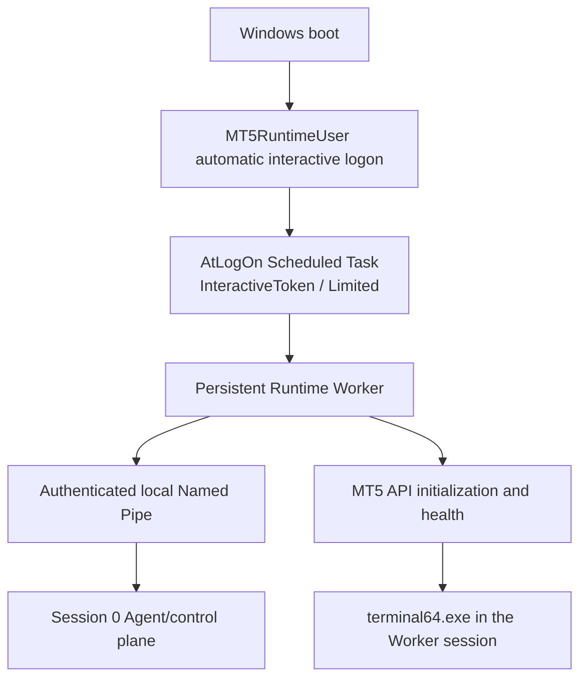

# MT5 Runtime Provisioning

This runbook covers the Windows runtime user, Worker installation, per-user
profile, task, machine-local configuration, and unattended interactive-session
bootstrap. It contains no credentials. Repository documentation describes the
product procedure; the lab notes at the end record validation evidence without
publishing account details.

## Runtime model and maturity

**Implemented:** dedicated account and Worker configuration scripts, protected
Worker install/data separation, an interactive task definition, named-pipe
authentication, Agent-side readiness handling, and Worker-owned persistent MT5
API lifecycle.

**Lab validated:** automatic runtime-user sign-in after cold boot with no RDP or
console login, task-triggered Worker startup, nonzero Worker session,
authenticated Session 0 IPC, MT5 initialization, connected health, terminal
ownership/session match, and safe reads.

**Not yet generally productionized:** signed installer/provisioning, Windows
Service installation and recovery policy, customer-specific account/broker
setup, supported upgrade/rollback packaging, and the first live Phase 4D
GitLab pipeline. The Agent process and its composition support the Session 0
control role; this does not mean a commercial Windows Service installer is
present.

## Runtime account and access

Use a dedicated standard local account named `MT5RuntimeUser` (or a configured
equivalent). It is not an Administrator, LocalSystem, or GitLab Runner identity.
Do not grant Remote Desktop Users membership solely to support unattended
operation. The account needs the normal interactive logon used to create its
Windows profile and an interactive session for the MT5 GUI/API runtime.

| Resource | Runtime-user access | Boundary |
| --- | --- | --- |
| MT5 installation, normally under Program Files | Read/execute | Administrator-owned installation |
| Worker install/code directory | Read/execute | SYSTEM and Administrators retain full control |
| Worker Python environment under install root | Read/execute | Immutable to the runtime user |
| Worker mutable state/logs | Modify its own user-local directory | Normally `%LOCALAPPDATA%\MT5Agent\RuntimeWorker` |
| MT5 profile/data | Modify its own profile | Normally `%APPDATA%\MetaQuotes\Terminal\...` |
| Machine runtime registry key | Read configured values | SYSTEM/Administrators manage configuration |
| Agent code/configuration and Runner | No write/control access | Managed separately by installation policy |
| Worker named pipe | Connect only when its SID is configured as `ControlPrincipal` | Local-only; remote clients rejected |

Do not copy an Administrator MetaQuotes profile wholesale. Create a fresh
profile for the runtime user and provision broker/account access through the
approved customer process. Treat terminal profile files as potentially
sensitive.

## Machine-local runtime configuration

The Worker and Windows Agent use `HKLM\SOFTWARE\MT5Agent\Runtime` for explicit
machine policy. The currently implemented values are:

| Value | Purpose |
| --- | --- |
| `RuntimePrincipal` | Account expected to own the Worker session |
| `ControlPrincipal` | Account SID allowed by the pipe DACL |
| `TerminalPath` | Explicit `terminal64.exe` binary |
| `ProfilePath` | Expected user-specific MetaQuotes terminal data directory |
| `WorkerInstallPath` | Protected Worker code and runtime location |
| `WorkerDataPath` | Mutable per-user Worker state location |
| `PipeName` | Local named-pipe endpoint |

The source does not default the production Worker profile to Administrator.
Missing or invalid required configuration fails closed for runtime readiness;
the Agent remains alive in degraded mode where its control-plane lifecycle
supports it. Do not put passwords, broker secrets, or Autologon material in
registry values or source-controlled files.

The current lab policy is configured for `WIN10-MT5-RUNNE\\MT5RuntimeUser`,
with `WIN10-MT5-RUNNE\\Administrator` as the lab control principal. Product
deployments must set `ControlPrincipal` to the actual Session 0 Agent service
identity. Machine-local values must not be copied into global GitLab CI
variables.

## Worker deployment and task

The authoritative source remains the repository. Deployment transfers a
controlled Worker source/package from the source tree into the protected
installation directory; the deployed host is not a second development checkout.
The Worker dependency set is `requirements-mt5-worker.txt`, separate from Agent
dependencies.

Register the task for the configured runtime user with these properties:

- `AtLogOn` trigger for that user;
- interactive token and limited run level;
- no stored task password and no “Run whether user is logged on or not” mode;
- no execution time limit;
- duplicate instances ignored;
- bounded restart attempts;
- no idle or battery stop conditions.

Task Scheduler restarts the Worker process within its configured bound. The
task is not responsible for creating an interactive session after cold boot;
that is the automatic-logon bootstrap's role. The Agent detects Worker
readiness instead of relying on a fixed sleep.

The lab retains the legacy Administrator task disabled for rollback. A
production migration must not enable two Workers competing for the same pipe.

## Automatic interactive logon and credential boundary

For deterministic cold-boot recovery, the accepted bootstrap uses Microsoft
Sysinternals Autologon plus the runtime user's interactive task. Configure
Autologon through its verified interactive UI, not from a password-bearing
command line. Do not set Winlogon `DefaultPassword`. Credentials must never be
placed in the repository, PowerShell/Python source, ordinary configuration,
logs, CI variables, or chat.

Autologon stores the credential as an encrypted LSA secret. Local
Administrators/SYSTEM can retrieve and decrypt it; compromise of either means
the host and runtime credential should be considered compromised. Anyone with
equivalent VPS console authority can access the automatically signed-in
runtime session. Restrict host administration and console access accordingly.
Password rotation and Autologon update must be coordinated through secure local
interfaces; never log or export the credential.

Automatic interactive logon is a deliberate availability/security tradeoff.
There is no cleaner supported mechanism in this design that creates the
required interactive user desktop after a cold boot without a user logon.
ARSO is not a required product dependency. Disk encryption and recovery-key
management belong to the machine owner or VPS provider. MT5 Agent provisioning
must never enable, disable, suspend, or reconfigure BitLocker, TPM, Secure Boot,
or recovery keys.

## Startup and readiness

The Agent's process starts independently in Session 0. At boot it may observe
no runtime session or Worker and must report a meaningful degraded state while
remaining alive. Readiness progresses from observed state, with bounded retry
and no arbitrary startup sleep:

1. Control plane starts and reports `AGENT_STARTING`/running status.
2. No runtime session means `RUNTIME_SESSION_UNAVAILABLE`.
3. Session exists but pipe/Worker is not ready: report `WORKER_UNAVAILABLE` or
   `WORKER_STARTING`.
4. Authenticate the configured local pipe peer and verify protocol, Worker
   principal, and nonzero session.
5. Request Worker health. If necessary, the Agent requests `initialize_readonly`
   through IPC; the Agent never imports or initializes MetaTrader5 itself.
6. Agent health distinguishes `AGENT_RUNNING` from runtime state. The live CI
   acceptance gate additionally requires `MT5_CONNECTED`, expected terminal
   owner/session/path, and successful safe reads before accepting a candidate.

| Failure | Expected owner and response |
| --- | --- |
| Automatic logon fails | Windows/admin recovery; Agent reports missing session |
| Runtime account missing/disabled | Provisioning/admin recovery; Worker remains unavailable |
| Session missing or logged off | Agent stays alive and degraded; no forced session recreation |
| Task does not start or Worker crashes | Task Scheduler bounded restart; Agent detects pipe loss |
| Pipe absent or authorization rejected | Agent reports unavailable/auth failure; no network fallback |
| Protocol mismatch | Fail closed and report incompatibility |
| MT5 initialize fails/disconnects | Worker reports error and owns bounded reconnect; Agent remains degraded |
| Terminal exits | Worker recovery policy; do not kill unrelated terminals |

RDP disconnect or closing the RDP client is distinct from logoff. Runtime is
intended to continue while the interactive session exists, including when
disconnected/locked. Explicit logoff destroys Worker and MT5; the Agent reports
degraded state and waits for authorized session recovery. It must not use
session-injection or fake-RDP techniques to recreate a logged-off desktop.

## Rollback and recovery

Keep migration reversible until the new runtime passes its acceptance gate.
Before rollback, save non-secret configuration values and task state; do not
copy secrets. Recovery should:

1. stop/disable the dedicated Worker task gracefully;
2. restore the prior configured runtime principal/profile only if the operator
   explicitly chooses the lab rollback;
3. re-enable the preserved Administrator task only after confirming no Worker
   owns the pipe;
4. retain the protected Worker code ACL and both user profiles;
5. verify pipe ownership, Worker/terminal identity, and health afterward.

Never terminate `terminal64.exe` by image name. Do not delete the old task/profile
as part of routine rollback.

## Lab validation record

The lab host has a standard `MT5RuntimeUser` profile and its own MetaQuotes
profile. Its machine runtime configuration targets that account and its
dedicated profile; the control principal is the lab's Session 0 Administrator
identity. The dedicated task is enabled and uses an interactive token. The
legacy Administrator task is preserved but disabled.

A cold reboot was validated without RDP or console login: automatic logon
created the runtime user's nonzero interactive session; the task started the
Worker; Session 0 authenticated to the local pipe; Worker initialization
succeeded; the terminal ran in the Worker session; connectivity and safe reads
passed. The exact machine identity and private account data are not required in
this product document. The first live Phase 4D GitLab pipeline remains pending.
