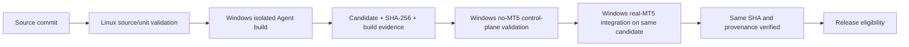

# Release Process

This document describes eligibility and artifact custody; it does not authorize
promotion, tagging, or publication. GitLab is the source of truth and GitHub is
a downstream mirror. Existing release tags and historical evidence are
immutable.

## Candidate flow

The invariant is **BUILD ONCE → TEST SAME ARTIFACT → RELEASE SAME ARTIFACT**.
The MT5 integration gate consumes the build artifact; it must not rebuild from
source. Build, control-plane, runtime, and final package receipts must agree on
pipeline ID, commit SHA, candidate version/name, and SHA-256. Any mismatch is a
hard failure, not a reason to substitute or rebuild.

The three Runner roles are `linux-source-unit`,
`windows-self-hosted-no-mt5`, and `windows-self-hosted-mt5`, with
`run_untagged=false`. The build/control-plane Runner has no local MT5 runtime
requirement. Only the real-MT5 gate consumes the persistent Worker and terminal.

## Release gates

1. Review the candidate diff, documentation, known issues, and version/tag
   agreement.
2. Pass Linux portable source/unit validation using `requirements-dev.txt`.
3. Pass Windows-compatible tests and build the release-style Agent in an
   isolated environment with MetaTrader5 and NumPy absent.
4. Recursively inspect the PyInstaller archive, including embedded PYZ:
   MetaTrader5, NumPy, Worker implementation, legacy direct adapter, and local
   terminal inspection must be absent.
5. Pass invalid-configuration and degraded control-plane checks on the
   no-MT5 Runner.
6. Pass real runtime preflight and production application-path health plus
   symbols total, terminal version, and account-information reads on the
   dedicated MT5 Runner. Evidence must redact account values.
7. Verify terminal/Worker owner and session consistency, connected health, and
   exact candidate SHA before/after the runtime gate.
8. Pass the package evidence gate without rebuilding.
9. Review the generated evidence and the [release checklist](../deployment/RELEASE_CHECKLIST.md).
10. Obtain separate authorization for branch promotion, tag creation, and
    publication. Those actions are outside an ordinary CI run.

There is no production trading test in the release gate. The historical ACL
experiment is not a mandatory release dependency. CI does not change Windows
accounts, tasks, Autologon, pipe ACLs, or machine security settings.

## Current status

**v0.1.3 is released.** The GitLab Release was published on 2026-10-06 at
02:58:30 UTC from tag `v0.1.3`, commit
`970c04712853295fd065094b11a2bd541b5a9db8`. Tag Pipeline #16 passed all eight
gates; package Job #125 produced the official release package. The
[release record](releases/v0.1.3-release-notes.md) carries the published
artifact provenance. Pipeline #11 remains historical candidate acceptance;
Pipeline #17 is separate post-release validation on `develop` and is documented
in [post-release evidence](evidence/v0.1.3/post-release-validation.md).

## Historical promotion and publication record

The [release-readiness audit](evidence/v0.1.3/release-readiness.md) is a dated
2026-10-06 snapshot of the pre-release review. Its original conclusions remain
historical; the appended post-release addendum records the later release state.

The release was published from the tag pipeline, not from the earlier Pipeline
#11 candidate. Pipeline #16 is the production provenance for the published
binary. Pipeline #17 ran later on `develop` and does not replace or redefine the
release provenance. The release artifact and checksum are recorded in the
[v0.1.3 release notes](releases/v0.1.3-release-notes.md).

Any future release still requires the applicable branch review, passing target
ref pipeline, exact package provenance, and separately authorized tag and
publication actions. The GitLab Release and Generic Package Registry remain
authoritative. A final tag-pipeline stage is intended to synchronize a verified
GitLab Release to GitHub; its credentials and protected-tag prerequisites are
not yet configured, so GitHub synchronization is not operational. See the
[GitHub Release sync runbook](GITHUB_RELEASE_SYNC.md). Never relabel Pipeline
#11 or #17 receipts as provenance for the v0.1.3 release or for a future
release.
