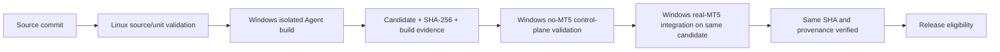

# Release Process

This document describes eligibility and artifact custody; it does not authorize
promotion, tagging, or publication. GitLab is the source of truth and GitHub is
a downstream mirror. Existing release tags and historical evidence are
immutable.

## Candidate flow

The invariant is **BUILD ONCE → TEST SAME ARTIFACT → RELEASE SAME ARTIFACT**.
The MT5 integration gate consumes the build artifact; it must not rebuild from
source. Build, control-plane, runtime, and final package receipts must agree on
pipeline ID, commit SHA, candidate version/name, and SHA-256. Any mismatch is a
hard failure, not a reason to substitute or rebuild.

The three Runner roles are `linux-source-unit`,
`windows-self-hosted-no-mt5`, and `windows-self-hosted-mt5`, with
`run_untagged=false`. The build/control-plane Runner has no local MT5 runtime
requirement. Only the real-MT5 gate consumes the persistent Worker and terminal.

## Release gates

1. Review the candidate diff, documentation, known issues, and version/tag
   agreement.
2. Pass Linux portable source/unit validation using `requirements-dev.txt`.
3. Pass Windows-compatible tests and build the release-style Agent in an
   isolated environment with MetaTrader5 absent.
4. Inspect the PyInstaller archive: MetaTrader5, NumPy, Worker implementation,
   legacy direct adapter, and local terminal inspection must be absent.
5. Pass invalid-configuration and degraded control-plane checks on the
   no-MT5 Runner.
6. Pass real runtime preflight and production application-path health plus
   symbols total, terminal version, and account-information reads on the
   dedicated MT5 Runner. Evidence must redact account values.
7. Verify terminal/Worker owner and session consistency, connected health, and
   exact candidate SHA before/after the runtime gate.
8. Pass the package evidence gate without rebuilding.
9. Review the generated evidence and the [release checklist](../deployment/RELEASE_CHECKLIST.md).
10. Obtain separate authorization for branch promotion, tag creation, and
    publication. Those actions are outside an ordinary CI run.

There is no production trading test in the release gate. The historical ACL
experiment is not a mandatory release dependency. CI does not change Windows
accounts, tasks, Autologon, pipe ACLs, or machine security settings.

## Current status

Phase 4D pipeline changes are **IMPLEMENTED** and **LOCALLY VALIDATED**. The
first live GitLab pipeline using the three Runner roles is **PENDING**. Do not
claim a pipeline ID, job result, release SHA, or v0.1.3 release until retained
GitLab evidence exists. The locally built Phase 4C executable is not an official
release artifact.
