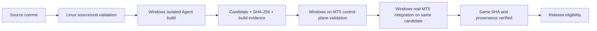

# Release Process

This document describes eligibility and artifact custody; it does not authorize
promotion, tagging, or publication. GitLab is the source of truth and GitHub is
a downstream mirror. Existing release tags and historical evidence are
immutable.

## Candidate flow

The invariant is **BUILD ONCE → TEST SAME ARTIFACT → RELEASE SAME ARTIFACT**.
The MT5 integration gate consumes the build artifact; it must not rebuild from
source. Build, control-plane, runtime, and final package receipts must agree on
pipeline ID, commit SHA, candidate version/name, and SHA-256. Any mismatch is a
hard failure, not a reason to substitute or rebuild.

The three Runner roles are `linux-source-unit`,
`windows-self-hosted-no-mt5`, and `windows-self-hosted-mt5`, with
`run_untagged=false`. The build/control-plane Runner has no local MT5 runtime
requirement. Only the real-MT5 gate consumes the persistent Worker and terminal.

## Release gates

1. Review the candidate diff, documentation, known issues, and version/tag
   agreement.
2. Pass Linux portable source/unit validation using `requirements-dev.txt`.
3. Pass Windows-compatible tests and build the release-style Agent in an
   isolated environment with MetaTrader5 and NumPy absent.
4. Recursively inspect the PyInstaller archive, including embedded PYZ:
   MetaTrader5, NumPy, Worker implementation, legacy direct adapter, and local
   terminal inspection must be absent.
5. Pass invalid-configuration and degraded control-plane checks on the
   no-MT5 Runner.
6. Pass real runtime preflight and production application-path health plus
   symbols total, terminal version, and account-information reads on the
   dedicated MT5 Runner. Evidence must redact account values.
7. Verify terminal/Worker owner and session consistency, connected health, and
   exact candidate SHA before/after the runtime gate.
8. Pass the package evidence gate without rebuilding.
9. Review the generated evidence and the [release checklist](../deployment/RELEASE_CHECKLIST.md).
10. Obtain separate authorization for branch promotion, tag creation, and
    publication. Those actions are outside an ordinary CI run.

There is no production trading test in the release gate. The historical ACL
experiment is not a mandatory release dependency. CI does not change Windows
accounts, tasks, Autologon, pipe ACLs, or machine security settings.

## Current status

Phase 4D is **LIVE CI ACCEPTED / GO** for the
[Pipeline #11 candidate](evidence/v0.1.3/phase4d-live-ci-acceptance.md), version
0.1.3 at `c4b945122ad7e7174dbbb433cb91b42cb66f1c72`.
[Draft release notes](releases/v0.1.3-release-notes.md) are prepared; v0.1.3 is
not tagged or published. The earlier local Phase 4C executable is not the
accepted release candidate.

## Controlled promotion and publication plan

The [release-readiness audit](evidence/v0.1.3/release-readiness.md) records branch
heads/divergence, CI/ref behavior, clock risk, and artifact retention.

1. Review the documentation follow-up and require its complete develop pipeline
   to pass. Keep the Pipeline #11 evidence tied to its original source commit.
2. Obtain explicit promotion authorization, then merge `develop → staging`
   preserving branch history; do not force-push or reset the historical merges.
3. Require all eight gates on the resulting staging ref and review that new
   candidate's provenance, diff, and non-trading runtime evidence.
4. Resolve the clock risk, or obtain explicit release-owner risk acceptance;
   verify package retention and draft release notes. Obtain separate authorization
   to merge `staging → main` and require all eight main gates.
5. After separate approval, create `v0.1.3` on the reviewed main commit. The tag
   workflow runs a fresh, separately provenanced candidate through all eight
   gates; require the tag/source version match. Do not claim the tag artifact is
   the Pipeline #11 artifact or rebuild a smoke-tested candidate.
6. With separate publication authorization, manually create the GitLab Release
   from that tag pipeline's exact `package:windows` output and receipts. Verify
   SHA-256 and publish the draft notes with the final tag provenance. CI currently
   neither creates tags nor publishes Releases. Confirm the downstream mirror
   separately; GitLab remains canonical.

The historical Pipeline #11 binary may only be published unchanged under a
separately approved plan that explicitly identifies its source commit and
pipeline; its receipts cannot be relabeled to a documentation/merge/tag commit.
