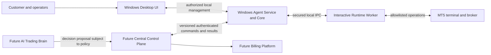
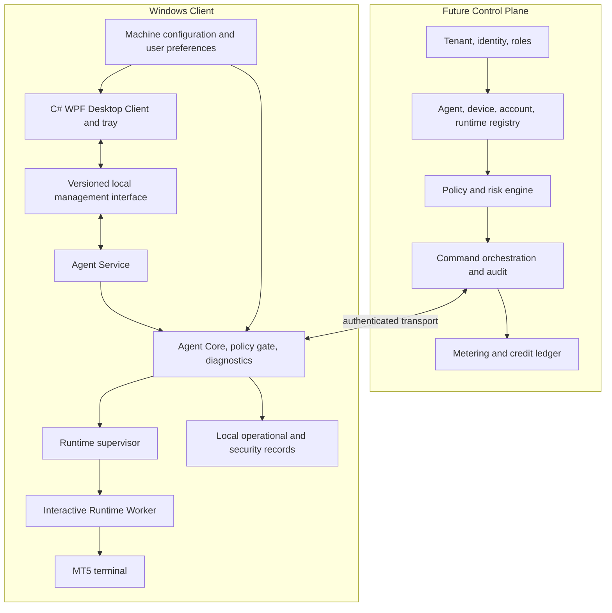
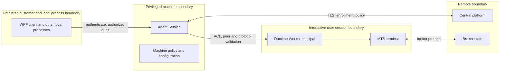

# MT5Agent Architecture Blueprint v1.0-draft

**Status:** Draft for architectural approval; not a release commitment.
**Repository baseline:** GitLab `origin/develop`, `d99182211696ef877171fda287dee01ef6e3fce7`, audited 2026-10-08.
**Principle:** Design for Scale, Implement for Today.

**Binding Product Owner decisions (2026-10-08):** C# / WPF / XAML / .NET
Framework 4.8 / MVVM Desktop Client integrated with the existing Python Agent
and Python MT5 Runtime Worker; Windows 10 x64, Windows 11 x64, Windows Server
2022 x64, Windows Server 2025 x64; v0.1.4 is Option A, a Desktop Client for an
already installed and provisioned Agent/Runtime. See [ADR-ARCH-015](adr/ADR-ARCH-015-wpf-technology.md)
and [ADR-ARCH-016](adr/ADR-ARCH-016-release-boundary-option-a.md).

## 1. Purpose and status vocabulary

This blueprint defines the long-term architecture of MT5Agent as the Windows
execution client of a future commercial AI Trading Platform, while preserving
the narrower, evidenced v0.1.3 implementation. It is a documentation baseline,
not authority to build central services or trade. “Accepted” applies only to
decisions recorded as agreed by the Product Owner; unapproved technical
choices remain Proposed or Open in the [ADRs](adr/README.md).

## 2. System context

**Accepted target:** central services make and authorize decisions; the Agent
checks identity, current policy, runtime state, and mandatory safety controls,
then executes only authorized instructions and reports structured outcomes.
The Agent is not an independent speculative strategy engine. Billing, customer
identity, Agent identity, device identity, terminal/account identity, and
runtime identity are separate domains.

**Deferred:** central control plane, AI brain, billing service, central
management UI, and Kubernetes deployment. They are future logical layers, not
current repository components. Kubernetes is an evolution option, not a
present deployment assumption.

## 3. Logical component architecture

This is a target decomposition. The actual composition currently consists of
the Python Agent, dispatcher, HTTP transport/host, observability, and an MT5
port selected at composition; see [baseline](IMPLEMENTATION_BASELINE.md). The
C# WPF Desktop Client, its management pipe, and Windows Service packaging are
not yet present as product capabilities.

## 4. Boundaries and trust

The current Named Pipe secures the Session 0 Agent-to-Worker link and is not a
UI API. The current `/command` HTTP composition is not approved for UI use: its
default composition uses allow-all authentication/authorization. Proposed
WPF-to-Python management IPC is a **different pipe with a separate DACL,
identity check, and per-operation authorization**. The UI must never access
Worker IPC. See [IPC contract](IPC_CONTRACT.md), [security](SECURITY_MODEL.md),
and [ADR-ARCH-017](adr/ADR-ARCH-017-management-ipc.md).

## 5. Core architectural rules

1. Service, UI, and Worker have independent lifecycles. UI shutdown or failure
   does not stop the Service or Worker; Service availability does not imply
   MT5 readiness.
2. One active Runtime is in v0.1.4 scope. Model identity and ownership so later
   multi-runtime operation does not rely on a process-global terminal.
3. C# WPF is a management client only; Python Agent remains the control plane,
   and only the interactive Python Worker owns the MT5 API on the supported Windows
   production path. Keep MT5 operations serialized until thread safety is
   demonstrated.
4. Enforce least privilege and explicit policy before every privileged action.
   UI experience level never grants permission.
5. An execution timeout is not proof of cancellation. Never replay an order
   with unknown outcome; reconcile against broker state first.
6. Billing balance is not an authentication factor or trade authorization.
   Protect and report existing positions independently from new-trade ability.
7. Status includes source and observation time. Unknown/stale values are never
   presented as live.
8. Preserve Build Once → Test Same Artifact → Release Same Artifact.

## 6. Domain and policy overview

Tenant owns Users, Devices, Agent Instances, Policies, and Billing Wallets.
Agent Instances register one or more Terminal Installations and Runtime
Instances; Trading Accounts may be visible to more than one Agent, while a
separate exclusive Execution Lease grants one active writer. Commands carry
idempotency and ownership epochs. Details and lifecycle are in the
[domain model](DOMAIN_MODEL.md).

Effective policy combines mandatory local safety, central risk policy,
organization policy, customer preference, role permissions, and account
constraints. Conflict resolution is fail-closed for new execution. Commands
that protect existing positions have their own authorization classes; a
stop-loss change is not inherently risk-reducing. See [trading safety](TRADING_SAFETY.md).

## 7. Security, configuration, and local contracts

Use separate machine configuration, per-Windows-user preferences, and future
central policy. Enforce ownership, schema/revision, validation, migration,
ACLs, secret storage under the consuming identity, and explicit offline
behavior. Never let UI preferences weaken safety policy. See
[configuration](CONFIGURATION.md).

The target local management API is versioned, authenticated, least-privilege,
bounded, correlated, and audited. HTTP Loopback versus Windows-native IPC is
an **Open Decision**. Starting a stopped Service uses Windows Service Control
Manager/UAC permissions, not an API hosted by that stopped Service. See
[local API](LOCAL_API.md).

## 8. Windows lifecycle, installer, and operations

Three components are independently managed: Agent Service in Session 0,
interactive MT5 Runtime Worker in a valid nonzero user session, and Desktop UI
in the user's desktop session. Existing Autologon + `AtLogOn` lab provisioning
is evidence for one topology, not an approved general installer. Simple,
Dedicated VPS, and Enterprise Managed startup profiles need explicit recovery
and credential policy. See [Windows runtime](WINDOWS_RUNTIME.md).

Installer and signed auto-update with integrity checks, staged deployment,
health verification, rollback, and schema compatibility are target capabilities.
Only the existing build/package/release automation is current; a customer
installer and complete automatic updater are absent. Support collection is
local-first, redacted, reviewable, and requires explicit consent before any
future transmission. See [operations](OPERATIONS.md).

## 9. Desktop UX target

The WPF/MVVM console has Dashboard, Runtime, Accounts, Security, Settings,
Logs, Diagnostics, Updates, Support, and About modules. Status contract
dimensions are `SERVICE_RUNNING`, `LOCAL_AGENT_RESPONSIVE`, `WORKER_READY`,
`MT5_CONNECTED`, `CENTRAL_CONNECTED`, `TRADING_CAPABILITY`, and
`TRADING_AUTHORIZED`. Each carries source, timestamp, age and reason. In Local
Setup, central is `NOT_CONFIGURED`; v0.1.4 trading capability is
`UNSUPPORTED`. English is default with resource-based i18n and RTL readiness.
The selected stack is C#/WPF/XAML/.NET Framework 4.8/MVVM; no framework
selection is open. See [Desktop UI](DESKTOP_UI.md) and
[WPF Solution](WPF_SOLUTION.md).

## 10. Commercial expansion

Future central layers include Tenant/IAM/RBAC, Agent/Device/Account/Runtime
registries, policy/risk evaluation, orchestrator, audit, support, enrollment,
licensing, and update management. Billing adds a wallet, pricing policy,
usage metering, transaction records, and auditable ledger. Credit exhaustion
may disable new discretionary operations under policy; it must not silently
disable monitoring, reporting, or protective management of existing positions.
Exact grace and billing rules are Open Decisions. See [vision](PRODUCT_VISION.md).

## 11. v0.1.4 boundary — Approved Option A

Deliver a reproducible C# WPF Desktop Client for an **already installed and
provisioned** Python Agent/Runtime. Include the modular shell, real local
status, per-user UI preferences, a dedicated least-privilege management
interface, offline diagnostics, tray/notifications, bounded log/diagnostic
views, and a testable user-scope deployment package for a prepared machine.
Keep the Python Agent and MT5 Worker as the operational foundation.

v0.1.4 does **not** require commercial installer, automatic Service
provisioning, runtime account creation, Autologon setup, enterprise deployment,
central platform, production billing, full auto-update/rollback, multi-runtime
execution, or multi-Agent failover. Service startup/restart remains subject to
existing Windows permissions; do not add an elevated custom helper without
separate approval. See [ADR-ARCH-016](adr/ADR-ARCH-016-release-boundary-option-a.md),
[Implementation Plan](IMPLEMENTATION_PLAN.md), and
[Acceptance](ACCEPTANCE_V0.1.4.md).

## 12. Navigation, decisions, and traceability

See [roadmap](ROADMAP.md), [risk register](RISK_REGISTER.md),
[glossary](GLOSSARY.md), [quality gates](QUALITY_GATES.md), and
[17 architecture ADRs](adr/README.md). ADR-ARCH-010 is retained as superseded
history. ADRs are
Proposed, Deferred, or Open unless a corresponding explicit product decision
or repository ADR supports Accepted status. No ADR here authorizes product
implementation by itself.
