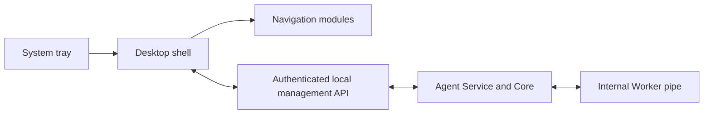

# Desktop UI Architecture

**Status:** Accepted product direction for an independent management console;
technology and detailed interaction design remain proposed/open. The current
repository has no Desktop UI or tray package. See [existing planning record](../planning/v0.1.4-desktop-ui.md).

## Responsibility and modules

The UI provides status, setup/configuration, diagnostics, authorized runtime
and service management, notifications, support and future enrollment. It does
not own Agent lifecycle, MT5 API connection, policy authority, or trading
strategy. Navigation modules: Dashboard, Runtime, Accounts, Security,
Settings, Logs, Diagnostics, Updates, Support, About. A module may be visibly
planned/disabled until it is operational; never imply that a future capability
works.

The only UI-to-Core path is a separate, authorized local management contract.
The UI must not connect directly to the internal Worker pipe. When the Service
is stopped or unavailable, UI still opens and displays current inability to
probe, last observation timestamp and recovery guidance. Stop/restart operations
use OS service control with appropriate UAC, not an API request to the stopped
service. Single instance versus controlled multi-window behavior is Open.

## Dashboard state model

Dimensions: `SERVICE_RUNNING`, `AGENT_CONNECTED`, `WORKER_READY`,
`MT5_CONNECTED`, `TRADING_ENABLED`. Each observation includes source, UTC/local
display timestamp, age, reason and correlation/probe identity where useful.
States: Unknown, Stale, Disconnected, Degraded, Ready. Cached state is labeled
stale and never displayed as a current measurement. “Ready” for service does
not imply trading is enabled. Role-aware default cards can be customized per
user; future cloud sync is deferred. A user layout never changes permissions.

## Language, appearance and accessibility

Default UI language English; set up resource-based i18n so Persian and RTL can
be added. Verify mirroring, mixed-direction identifiers, dates, numbers and
screen-reader semantics before offering RTL. Professional, simple modular
layout with design tokens and dark/light readiness. Midnight Terminal is a
preference in the existing planning record, not a finalized design system.
KivyMD remains conditional pending compatibility, accessibility, packaging and
Windows lifecycle spike. Provide keyboard access, visible focus, scalable text,
contrast, non-color status cues and Windows display-scaling tests.

## Tray, close, notifications

Configurable Close to Tray versus Exit UI; reopening from Start Menu; tray
failure isolated from Agent execution. Distinguish hide, UI exit, service
stop and runtime stop. Notifications have severity, notification center, tray
status, supported Windows notifications, preferences, deduplication and rate
limits. Suppressing display must never suppress a safety guard, audit, or
command rejection.

## Progressive disclosure

Simple customer view exposes meaningful status and safe common settings.
Advanced technical view exposes evidence, correlation ID, runtime details and
diagnostics. Visibility can be role-aware; level of experience only changes
presentation and never grants action permissions. Confirm sensitive actions
with target, consequence and audit context.

## v0.1.4 minimum

Modular shell/navigation, actual Agent/runtime status, local setup, user
preferences, service-independent startup, offline diagnostics/guidance, tray,
close behavior, basic notices and a safe local API foundation. Technology
choice, accessibility baseline, Windows UI automation strategy and elevated
service-control model are release gates. Account controls that imply actual
multi-account execution remain out of scope until their backend and policy
contracts exist.
