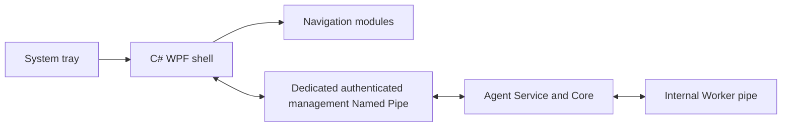

# Desktop UI Architecture

**Status:** C# WPF/XAML on .NET Framework 4.8 with MVVM is approved by the
Product Owner. **Option A** is approved: this is a client for an already
installed/provisioned Agent and Runtime. The WPF shell, tests, read-only
Management IPC and observed Agent/Runtime status integration now exist under
[`src/desktop`](../../src/desktop/README.md). Runtime, per-user Settings,
bounded Management Logs, local Diagnostics, and notification-area lifecycle
are implemented; interactive Windows release validation remains a distinct
gate. The earlier Kivy
planning note is retained as superseded history at
[planning/v0.1.4-desktop-ui.md](../planning/v0.1.4-desktop-ui.md).

## Responsibility and modules

The C# UI provides status, local setup for an existing Agent, diagnostics,
authorized Runtime management, notifications, support and future enrollment.
It does not own Agent lifecycle, MT5 API connection, policy authority, or
trading strategy. Navigation modules: Dashboard, Runtime, Accounts, Security,
Settings, Logs, Diagnostics, Updates, Support, About. A module may be visibly
planned/disabled until it is operational; never imply that a future capability
works.

The only UI-to-Core path is the separate, authorized management pipe
defined in [IPC_CONTRACT.md](IPC_CONTRACT.md).
The UI must not connect directly to the internal Worker pipe. When the Service
is stopped or unavailable, UI still opens and displays current inability to
probe, last observation timestamp and recovery guidance. Stop/restart operations
use OS service control with appropriate UAC, not an API request to the stopped
service. Single instance versus controlled multi-window behavior is Open.

## Dashboard state model

Dimensions: `SERVICE_RUNNING`, `LOCAL_AGENT_RESPONSIVE`, `WORKER_READY`,
`MT5_CONNECTED`, `CENTRAL_CONNECTED`, `TRADING_CAPABILITY`,
`TRADING_AUTHORIZED`. Each observation includes source, UTC observation time,
age and reason; the response envelope carries a correlation ID. States include Ready, Degraded, Disconnected,
Stale, Unknown, Unsupported, Not Configured, and Not Authorized. Local Setup
shows central connectivity as `NOT_CONFIGURED`; v0.1.4 trading capability is
`UNSUPPORTED`, not a fake toggle. See [IPC_CONTRACT.md](IPC_CONTRACT.md) for
implemented 5 s polling and 15 s stale threshold. Cached state is labeled
stale, never current. The current UI's provenance details remain limited.
Dashboard cards are modular; each user's ordering/visibility is a per-user
preference seeded from machine defaults. Future central sync is deferred.
Presentation never changes permissions.

## Language, appearance and accessibility

Default UI language English with `.resx` resource-based localization. Prepare
direction-aware layout for Persian/RTL and test mixed-direction IDs, dates and
numbers before enabling Persian. Use a consistent Fluent-inspired WPF design
system, centrally defined color/typography/spacing/component tokens and dark/
light themes. Approved framework selection is closed; see
[WPF_SOLUTION.md](WPF_SOLUTION.md) for stack and library evaluation. Support
keyboard access, visible focus, scalable text, accessible names, contrast,
non-color status cues and Windows display-scaling tests.

## Tray, close, notifications

Configurable Close to Tray versus Exit UI; reopening from Start Menu or tray;
tray failure isolated from Agent execution. Distinguish hide, UI exit, service
stop and runtime stop. Notifications currently report Agent connectivity
transitions through the Windows notification area, honor the per-user
preference, and use a 30-second rate limit. A persistent Notification Center
and general severity workflow are deferred. Suppressing display never
suppresses a safety guard, audit, or command rejection.

## Progressive disclosure

Simple customer view exposes meaningful status and safe common settings.
Advanced technical view exposes evidence, correlation ID, runtime details and
diagnostics. Visibility can be role-aware; level of experience only changes
presentation and never grants action permissions. Confirm sensitive actions
with target, consequence and audit context.

## v0.1.4 minimum

Option A delivers a reproducible WPF build and testable user-scope package for
an already prepared machine. Include modular shell/navigation, real
Agent/Runtime status, Local Setup, per-user preferences, service-independent UI
startup, offline diagnostics/guidance, tray, close behavior, basic notices,
and the dedicated secure management pipe. No commercial installer or automatic
Service provisioning is required. WPF technology is approved; remaining gates
are production Service identity/SID provisioning, UIA/accessibility, package
validation, and Windows matrix evidence. Full account execution is unsupported.

## Related implementation references

[WPF Solution and Design System](WPF_SOLUTION.md) ·
[Phase 1 build/test instructions](../../src/desktop/README.md) ·
[IPC Contract](IPC_CONTRACT.md) · [Quality Gates](QUALITY_GATES.md) ·
[Acceptance](ACCEPTANCE_V0.1.4.md)

## Phase 5 interactive validation — 2026-10-08

The available Windows hosts have interactive console sessions, but this
execution could not attach a UI automation/display capture client to them. The
latest actual WPF launch, UI Automation and theme/tray screenshots are the
Phase 4 Windows 10 Session 1 evidence under
[`../evidence/v0.1.4/phase4/`](../evidence/v0.1.4/phase4/). Do not mark the
Phase 5 visual, DPI, accessibility, notification, or lifecycle gates as
revalidated. No Phase 5 visual defect was confirmed because the application
was not launched in an interactive desktop during this phase.

## Distribution boundary — Phase 6

The v0.1.4 Desktop distribution is a versioned ZIP of the WPF client for an
already provisioned Agent. It contains neither Python runtime components nor
machine/credential configuration and does not modify them. Extract into a
versioned user-writable path; per-user preferences stay under
`%LOCALAPPDATA%\MT5Agent\Desktop` and survive side-by-side replacement.
Removal is limited to that Desktop version directory and its shortcut. See
[Distribution](DISTRIBUTION.md) for the package manifest, exact artifact
provenance and evidence status. A code-signed commercial installer and
automatic updater are not delivered in v0.1.4.
