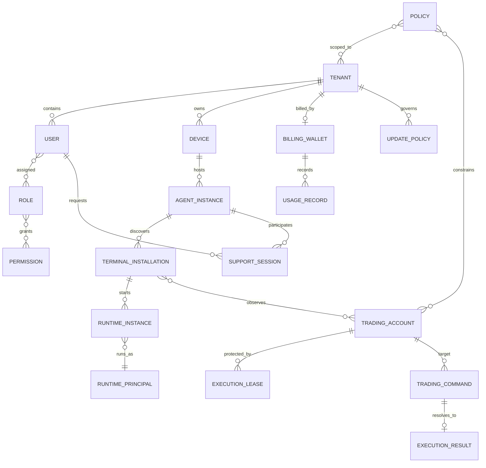

# Domain Model

**Status:** Proposed target model. Existing code contracts are not equivalent
to a complete persisted or centrally managed product domain.

## Relationships

The diagram expresses conceptual ownership/cardinality, not current database
tables. `ExecutionLease` is a time-bounded authority grant; it is not account
visibility or a permanent account lock. A command/result relationship can
include unresolved outcomes requiring reconciliation before another attempt.

## Entity contracts

| Entity | Owner / lifecycle | Security boundary and invariants |
|---|---|---|
| Tenant | Platform customer; provisioned, active, suspended, closed | Top-level data isolation. Tenant ID is not an authentication secret. |
| User | Tenant IAM; invited, active, disabled, removed | Human identity; authentication separated from role/permission assignment. |
| Role | Tenant/platform policy; versioned | Named permission set; role changes audited. Experience level is not a role. |
| Permission | Platform policy vocabulary; versioned | Action + resource scope + conditions. Deny-by-default on unknown permission. |
| Device | Tenant enrollment; enrolled, revoked, retired | Device key/certificate stored under protected OS identity; revocation invalidates new sessions. |
| Agent Instance | Installed client enrollment; created, active, disabled, retired | Unique logical installation identity, distinct from user/device/runtime. |
| Trading Account | Tenant-controlled registry; discovered, confirmed, active, disabled | Store non-secret broker/account references where possible; protect identifiers and never infer trade authority from discovery. |
| Terminal Installation | Local discovery/config; detected, configured, unavailable, removed | Path/version and owning device; validate path and executable identity before use. |
| Runtime Instance | Process lifecycle; starting, ready, degraded, stopping, stopped, failed | Binds Agent Instance, terminal, principal, session and generation. v0.1.4 has one active Runtime. |
| Runtime Principal | OS principal lifecycle; selected, provisioned, rotated, disabled | Windows identity that can access terminal and secrets; account creation/autologon needs explicit consent and security review. |
| Policy | Owner-scoped and revisioned; draft, active, superseded | Central/org/customer/account/local safety scopes; provenance and effective revision retained. |
| Execution Lease | Central authority with expiry/epoch; granted, renewed, expired, revoked | One writer per account; monotonically increasing fencing token; stale epoch rejected. |
| Trading Command | Orchestrator-issued; received, validated, executing, resolved/unknown/rejected | Authenticated issuer, audience, scope, command ID, policy revision, idempotency key and expiry. |
| Execution Result | Agent-produced; acknowledged, reconciled, unresolved | Outcome must distinguish confirmed success, confirmed rejection, and unknown. Never fabricate confirmation on timeout. |
| Usage Record | Metering service; pending, accepted, disputed, reversed | Immutable/auditable entries; pricing version and source event; corrections are compensating entries. |
| Billing Wallet | Tenant billing; active, exhausted, suspended, closed | Ledger-backed balance; never credential, token, permission or execution lease. |
| Support Session | Customer-authorized; requested, consented, active, expired, revoked | Time-bound, narrowly scoped, purpose-bound, audited; privileged action requires own permission. |
| Update Policy | Platform/org/customer/machine; active, paused, superseded | Channel, severity, allowed window, deferral and rollback policy. Does not authorize arbitrary code. |

## Account ownership and failover

Several Agents may discover or report the same Trading Account. Only one
current lease may authorize writes. A lease contains owner Agent/Runtime,
expiry, and monotonically increasing epoch. Every mutating command carries the
epoch and idempotency key; the receiver rejects expired or stale epochs. On
partition or uncertain execution, do not grant a new writer solely because a
heartbeat disappeared. Reconcile broker state, then transfer ownership under
an audited policy. Idempotency keys prevent duplicate dispatch but do not
replace broker-side reconciliation.

## v0.1.4 modeling seam

Support one active MT5 Runtime without making account state, terminal selection,
or worker transport a global singleton in the conceptual model. Do not ship
leases/failover infrastructure in v0.1.4 unless separately approved. Preserve
the four account workflows: discovery, manual configuration, customer
confirmation and future web-console management.
