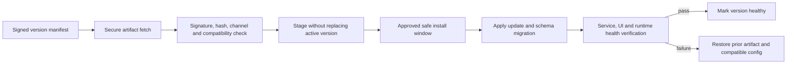

# Operations, Installation, Diagnostics and Support

**Status:** Operational target design; not all capabilities exist. Current
evidence is linked in [Implementation Baseline](IMPLEMENTATION_BASELINE.md).

## Installation and maintenance

**v0.1.4 Option A:** deliver a reproducible WPF build and a testable user-scope
deployment package for a machine where Agent Service/Runtime are already
installed and provisioned. Document .NET Framework 4.8-or-later prerequisite,
package extraction/launch/removal, hash verification, and offline first-run.
The package must not install/configure Service, create accounts, set Autologon,
or mutate existing Agent configuration. Commercial Simple/Advanced installers,
repair and enterprise provisioning are later work.

Approved UI OS matrix, x64 only:

| OS | UI support | Requirement |
|---|---|---|
| Windows 10 | Supported by Product Owner | Record edition/build and current security servicing/ESU; end-of-general-support risk remains active. |
| Windows 11 | Supported | Validate current supported release and .NET runtime. |
| Windows Server 2022 | Supported | Desktop Experience required; Server Core unsupported. |
| Windows Server 2025 | Supported | Desktop Experience required; Server Core unsupported. |

All other Windows versions are out of scope for the commercial UI. Microsoft
lists .NET Framework 4.8 as compatible with these OS families, with 4.8.1
preinstalled on current Windows 11/Server 2025 and available to Server 2022;
an app targeting 4.8 runs on the in-place 4.8.1 runtime. WPF requires an
interactive desktop. Server Core lacks the standard GUI shell and is not a
supported UI host.

Windows 10 22H2 general support ended 2025-10-14. ESU is time/edition/program
limited; product must not imply that technical launch compatibility equals
Microsoft security support. Reconfirm lifecycle at every release. See
[Quality Gates](QUALITY_GATES.md) for primary Microsoft sources.

## Update, staged rollout and rollback

Future Auto-Update requires signed manifest, signer trust rotation, artifact
integrity, secure delivery, channels, OS/runtime compatibility, staged install,
safe window based on trading state/account policy, schema compatibility,
health verification, rollback and audit. Updates must not interrupt active
execution without explicit policy. Auto-update and rollback are long-term
requirements, not asserted v0.1.4 capabilities. Update severity, customer
deferral and enterprise windows remain Open.

## Diagnostics and observability

Emit bounded structured operational records with UTC timestamps, severity,
component, event code, correlation ID and sanitized context. Keep operational
logs distinct from security audit. Define rotation, retention, disk quota,
clock-health and export behavior before making logs a support promise. Provide
health per Service, Worker, MT5, central connection, policy and trading
authorization; identify source, timestamp and freshness. Use structured errors
and actionable next step; no secrets, raw credentials, or full command payloads.

## Support and support bundles

Support authorization varies by customer type, role, operation sensitivity,
consent and audit. Future remote sessions are time-bound, narrow-scope,
revocable and purpose-bound. Separate local bundle generation from any central
upload.

Bundle workflow: collect minimum information → redact → create manifest of
files/versions/time span → customer preview → explicit consent before future
transmission → secure upload with receipt. Never include passwords, tokens,
private keys or broker credentials. Identify partial collection and redaction
results. Local export in v0.1.4 must not claim upload/submission.

## Incident and recovery record

Every recovery action states trigger, desired state, actor, attempt number,
backoff, error classification and resulting health. Intentional stop suppresses
failure restart. Retry policy is bounded and jittered; permanent configuration,
identity or authorization errors require human correction rather than rapid
retry. Preserve enough audit for incident review while respecting retention
limits and customer privacy.
