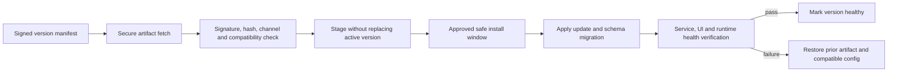

# Operations, Installation, Diagnostics and Support

**Status:** Operational target design; not all capabilities exist. Current
evidence is linked in [Implementation Baseline](IMPLEMENTATION_BASELINE.md).

## Installation and maintenance

Target Simple Setup for individual customers and Advanced Setup for VPS and
enterprise. Check OS architecture/support policy and prerequisites; install
Service and UI; choose an existing Windows runtime account or create a
dedicated account only with explicit approval; discover MT5; verify interactive
session readiness; run health checks. Include repair, upgrade compatibility,
and uninstall that removes only owned resources and explains retained user data.

Windows 10 x64 is subject to security/support policy; Windows 11 x64 and
selected Windows Server x64 families require compatibility validation. Windows
7 is a legacy test environment, not a new Desktop UI target. No supported OS
matrix is fully validated by this draft.

## Update, staged rollout and rollback

Future Auto-Update requires signed manifest, signer trust rotation, artifact
integrity, secure delivery, channels, OS/runtime compatibility, staged install,
safe window based on trading state/account policy, schema compatibility,
health verification, rollback and audit. Updates must not interrupt active
execution without explicit policy. Auto-update and rollback are long-term
requirements, not asserted v0.1.4 capabilities. Update severity, customer
deferral and enterprise windows remain Open.

## Diagnostics and observability

Emit bounded structured operational records with UTC timestamps, severity,
component, event code, correlation ID and sanitized context. Keep operational
logs distinct from security audit. Define rotation, retention, disk quota,
clock-health and export behavior before making logs a support promise. Provide
health per Service, Worker, MT5, central connection, policy and trading
authorization; identify source, timestamp and freshness. Use structured errors
and actionable next step; no secrets, raw credentials, or full command payloads.

## Support and support bundles

Support authorization varies by customer type, role, operation sensitivity,
consent and audit. Future remote sessions are time-bound, narrow-scope,
revocable and purpose-bound. Separate local bundle generation from any central
upload.

Bundle workflow: collect minimum information → redact → create manifest of
files/versions/time span → customer preview → explicit consent before future
transmission → secure upload with receipt. Never include passwords, tokens,
private keys or broker credentials. Identify partial collection and redaction
results. Local export in v0.1.4 must not claim upload/submission.

## Incident and recovery record

Every recovery action states trigger, desired state, actor, attempt number,
backoff, error classification and resulting health. Intentional stop suppresses
failure restart. Retry policy is bounded and jittered; permanent configuration,
identity or authorization errors require human correction rather than rapid
retry. Preserve enough audit for incident review while respecting retention
limits and customer privacy.
