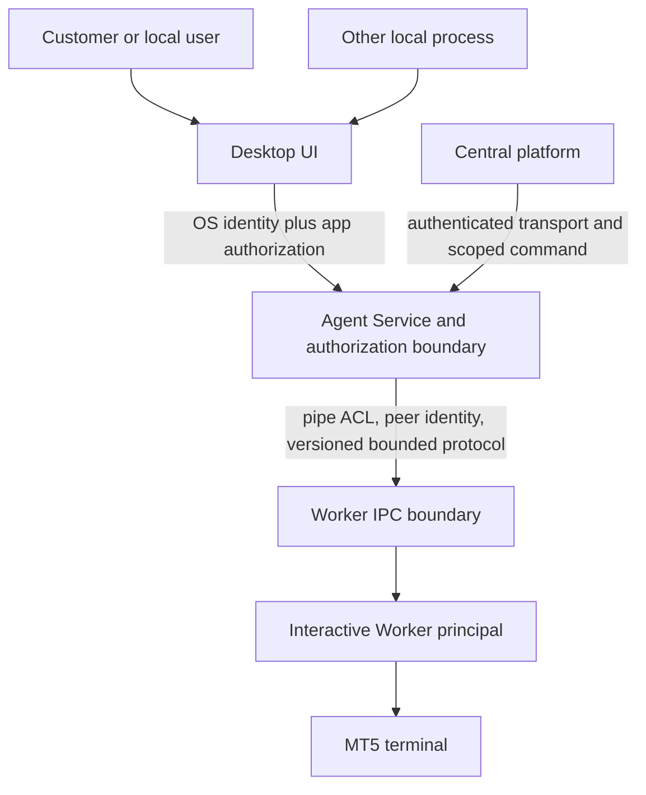

# Security Model

**Status:** Proposed target controls plus current boundary evidence in
[Implementation Baseline](IMPLEMENTATION_BASELINE.md). This document is not a
security certification.

## Assets and principals

Assets: broker credentials and sessions, account identifiers, trading
commands/results, machine configuration, local enrollment keys, policy,
runtime process, support data, update artifacts, audit records, and billing
records. Principals: customer user, tenant administrator, Windows UI user,
Agent Service identity, Runtime Worker principal, central service, update
signer, support operator, and local administrator. Each principal gets only
the operations and data required for its role.

## Trust boundaries

## Required controls

- Authenticate user, Agent, device and central service identities independently;
  bind tokens to audience, scope, expiry and revocation.
- Authorize every operation by principal, resource, action and policy revision;
  default deny, including unknown commands and schema versions.
- Keep Worker pipe ACL/identity checks separate from UI local API. Existing
  Named Pipe supports the Session 0 Agent/Worker boundary only.
- Bind local management to loopback or OS IPC, but do not treat loopback as
  authentication. For HTTP, define CSRF/origin protections, random/session
  credentials, replay protections and safe browser-origin behavior. Prefer a
  Windows-native identity-bound IPC design only after compatibility review.
- Never extend current permissive development auth (`AllowAllAuthenticator`,
  `AllowAllAuthorizer`) to privileged UI actions. Do not expose existing
  `/command` beyond its development purpose.
- Validate and bound inputs, payload size, work duration, concurrency and
  queues. Return stable error codes without raw secret-bearing values.
- Protect logs, diagnostics, config and support artifacts with ACLs, retention
  budgets and redaction. Do not include passwords, tokens, private keys, or
  broker credentials.
- Audit privileged action, actor, target, policy revision, correlation ID,
  result and timestamp; minimize stored customer data.
- Verify update signatures and artifact hashes against a trusted signed
  manifest before execution; do not trust transport TLS alone.

## Threat scenarios to design against

Local unprivileged process attempts API control; one Windows user attempts to
read another user's settings; compromised UI attempts arbitrary Worker
operations; local command replay; stolen Agent token; central policy conflict;
malformed/oversized messages; pipe impersonation or wrong session; malicious
update; support-bundle leakage; runtime identity/session loss; multi-Agent
split-brain; clock rollback; and crash during a trading operation.

## Recovery authority

A stopped Windows Service cannot serve its own control endpoint. UI recovery
must use Service Control Manager operations mediated by Windows permissions
and UAC, or an explicitly designed elevated helper. A helper may expose only
the minimum service action and must not become a general privileged command
broker. The UI must explain denied/required elevation without storing admin
credentials.

## Secrets and identity

Secret storage must be decryptable only by the runtime principal that needs the
secret. Evaluate Windows Credential Manager and DPAPI by identity, service
account, backup, rotation, revocation and recovery behavior; do not select a
mechanism from its name alone. Do not create accounts, enable Autologon, or
store credentials without explicit customer approval and a threat review.

## Security gates

Before privileged UI management ships: documented permission matrix, abuse
cases, negative authorization tests, Windows identity tests across sessions,
bounded concurrency tests, audit and redaction review, and independent stopped-
service recovery review. Before central enrollment/trading: protocol and key
lifecycle review, command authorization, expiry/replay, policy revision,
execution lease, and ambiguous-outcome reconciliation design.
