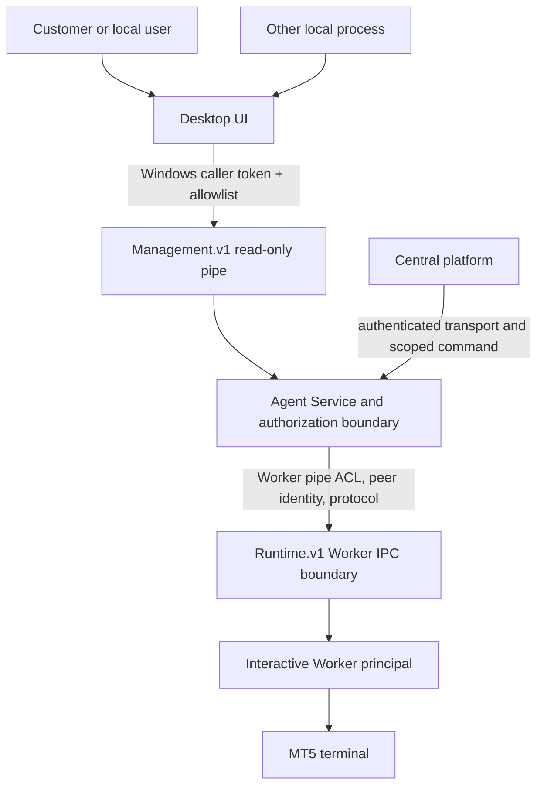

# Security Model

**Status:** Implemented read-only Management IPC controls with remaining
provisioning and multi-session gates. This document is not a security
certification. Evidence and boundaries are recorded in
[Implementation Baseline](IMPLEMENTATION_BASELINE.md).

**Approved client stack:** C# WPF/XAML/.NET Framework 4.8/MVVM. The UI is an
untrusted local caller relative to the Python Agent Service. The selected
transport proposal is a distinct Windows Named Pipe, not the current `/command`
HTTP composition and not the internal MT5 Worker pipe; see
[IPC_CONTRACT.md](IPC_CONTRACT.md).

## Assets and principals

Assets: broker credentials and sessions, account identifiers, trading
commands/results, machine configuration, local enrollment keys, policy,
runtime process, support data, update artifacts, audit records, and billing
records. Principals: customer user, tenant administrator, Windows UI user,
Agent Service identity, Runtime Worker principal, central service, update
signer, support operator, and local administrator. Each principal gets only
the operations and data required for its role.

## Trust boundaries

## Required controls

- Authenticate user, Agent, device and central service identities independently;
  bind tokens to audience, scope, expiry and revocation.
- Authorize every operation by principal, resource, action and policy revision;
  default deny, including unknown commands and schema versions.
- Keep Worker pipe ACL/identity checks separate from UI local API. Existing
  `MT5Agent.Runtime.v1` remains the Session 0 Agent/Worker boundary; WPF opens
  only `MT5Agent.Management.v1`.
- The management pipe DACL allows the Service process token SID and explicitly
  configured user SID(s). Python derives caller SID from the connected pipe
  token with `ImpersonateNamedPipeClient` and `TokenUser`, then calls
  `RevertToSelf` in `finally`. Implemented operations are read-only
  `protocol.negotiate`, `status.get`, and bounded `logs.query`; all other
  operations are denied. Log data is a fixed-message in-memory Management
  event buffer and the query accepts no path or arbitrary filter expression.
  Caller JSON identity claims are ignored. Empty
  `MT5_AGENT_MANAGEMENT_ALLOWED_SIDS` disables the listener.
- Keep WPF running as the interactive user; do not elevate the whole UI to
  communicate with Service. Windows SCM ACL/UAC remains the separate recovery
  path for Service start/stop.
- Bind local management to loopback or OS IPC, but do not treat loopback as
  authentication. For HTTP, define CSRF/origin protections, random/session
  credentials, replay protections and safe browser-origin behavior. Prefer a
  Windows-native identity-bound IPC design for any future alternate transport.
- Never extend current permissive development auth (`AllowAllAuthenticator`,
  `AllowAllAuthorizer`) to privileged UI actions. Do not expose existing
  `/command` beyond its development purpose.
- Validate and bound inputs, payload size, work duration, concurrency and
  queues. Return stable error codes without raw secret-bearing values.
- Protect logs, diagnostics, config and support artifacts with ACLs, retention
  budgets and redaction. Do not include passwords, tokens, private keys, or
  broker credentials.
- Audit privileged action, actor, target, policy revision, correlation ID,
  result and timestamp; minimize stored customer data.
- Verify update signatures and artifact hashes against a trusted signed
  manifest before execution; do not trust transport TLS alone.

## Threat scenarios to design against

Local unprivileged process attempts API control; one Windows user attempts to
read another user's settings; compromised UI attempts arbitrary Worker
operations; local command replay; stolen Agent token; central policy conflict;
malformed/oversized messages; pipe impersonation or wrong session; malicious
update; support-bundle leakage; runtime identity/session loss; multi-Agent
split-brain; clock rollback; and crash during a trading operation.

## Recovery authority

A stopped Windows Service cannot serve its own control endpoint. Under approved
Option A, prefer native Service Control Manager permissions and standard UAC
for an already provisioned Agent. A custom elevated helper is outside scope
unless a demonstrated product requirement and separate security review justify
it. The WPF UI remains usable if SCM denies start; never store admin credentials.

## Secrets and identity

Secret storage must be decryptable only by the runtime principal that needs the
secret. Evaluate Windows Credential Manager and DPAPI by identity, service
account, backup, rotation, revocation and recovery behavior; do not select a
mechanism from its name alone. Do not create accounts, enable Autologon, or
store credentials without explicit customer approval and a threat review.

## Security gates

Before management pipe ships: documented caller-SID/operation matrix, service
identity, exact pipe DACL, identity-impersonation/revert proof, abuse cases,
negative authorization tests across sessions, bounded concurrency, audit and
redaction review. Before Runtime restart operations ship, additionally prove
owned-process identity and no broad terminal kill. Before central enrollment/
trading: protocol and key lifecycle review, command authorization, expiry/
replay, policy revision, execution lease, and ambiguous-outcome reconciliation.

## Phase 5 focused implementation review — 2026-10-08

The Windows 10 source/test run exercised the current Management IPC contract and
regression suite. The full Windows Python suite reported **318 passed, 2
skipped**; those two were the fail-closed Worker Window Station/Desktop ACL
experiments, not passed by the general suite. They were then run separately in
a one-shot Session 0 LocalSystem task with explicit test-only variables and
passed **2/2**. Caller token evidence was `NT AUTHORITY\SYSTEM`, SID
`S-1-5-18`, Session 0. The expected interactive principal was
`WINDOW10-TEST\Administrator`, SID
`S-1-5-21-950479549-2068523145-3370569714-500`, Session 1. DACL experiment
proved additive grant and exact rollback; before/after hashes and cleanup result
are in the linked evidence bundle.

This is Worker Window Station/Desktop ACL evidence. A separate isolated
`MT5AgentPhase5Test` SCM harness was later installed with explicit approval. A
temporary .NET `ServiceBase` host ran the real Python Agent Core child in
Session 0 with the real Management Pipe and a Runtime adapter configured
unconditionally unavailable. The pipe served a read-only status response and
bounded fixed-message `logs.query` events to the explicitly allowed local
Administrator SID. A LocalSystem client connected but received `UNAUTHORIZED`
for both operations, confirming the operation allowlist; the exact response
and service process SID/session are in the Phase 5 evidence bundle. The Service
and test host were stopped and removed after validation.

The initial NetworkService negative DACL probe did not execute: Task Scheduler
returned `0x80070005` before a caller SID or probe result was written, and that
failure is not counted as a denial. A subsequent authorized, isolated test
created a temporary ordinary Users-only account and verified its actual
TokenUser SID; the live Management pipe's `CreateFile` returned Win32
`ERROR_ACCESS_DENIED (5)` before any request payload. The allowlisted
Administrator still opened the same pipe and completed the read-only status
and bounded-log operations. Raw evidence is in the Phase 5 Windows 10 evidence
bundle. Source review confirms the Management pipe DACL
is built with only the Agent process token SID plus explicitly configured
client SID(s), and no broad SID; revalidate the runtime ACL under the eventual
product Service identity. `logs.query` remains bounded to 100 items from a
200-event in-memory ring, fixed severities/messages, and accepts no path or
caller-supplied content. RDP/multi-session behavior and a diagnostic
secret-canary scan remain open.

The test harness required one correction: its interactive helper previously
called `WTSQueryUserToken`, which requires LocalSystem/SeTcbPrivilege. It now
verifies its own process session and `TokenUser` principal, then reads the
logon-SID group from that process token. The Session 0 parent remains the only
component that selects the WTS session and starts the helper. The positive
identity test and both end-to-end ACL experiments passed without weakening
DACL assertions. This is a test-harness fix, not a product Service security
certification.
