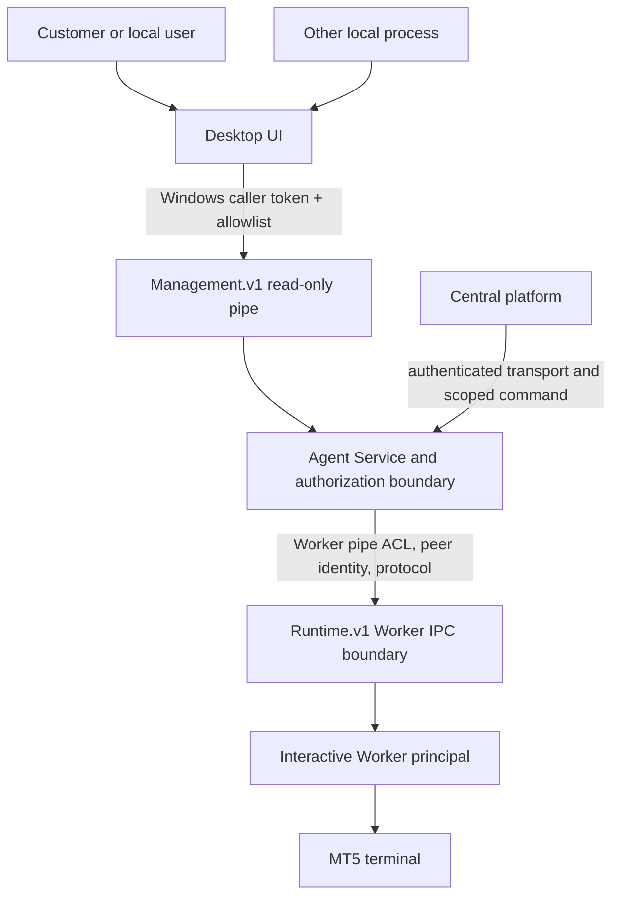

# Security Model

**Status:** Implemented read-only Management IPC controls with remaining
provisioning and multi-session gates. This document is not a security
certification. Evidence and boundaries are recorded in
[Implementation Baseline](IMPLEMENTATION_BASELINE.md).

**Approved client stack:** C# WPF/XAML/.NET Framework 4.8/MVVM. The UI is an
untrusted local caller relative to the Python Agent Service. The selected
transport proposal is a distinct Windows Named Pipe, not the current `/command`
HTTP composition and not the internal MT5 Worker pipe; see
[IPC_CONTRACT.md](IPC_CONTRACT.md).

## Assets and principals

Assets: broker credentials and sessions, account identifiers, trading
commands/results, machine configuration, local enrollment keys, policy,
runtime process, support data, update artifacts, audit records, and billing
records. Principals: customer user, tenant administrator, Windows UI user,
Agent Service identity, Runtime Worker principal, central service, update
signer, support operator, and local administrator. Each principal gets only
the operations and data required for its role.

## Trust boundaries

## Required controls

- Authenticate user, Agent, device and central service identities independently;
  bind tokens to audience, scope, expiry and revocation.
- Authorize every operation by principal, resource, action and policy revision;
  default deny, including unknown commands and schema versions.
- Keep Worker pipe ACL/identity checks separate from UI local API. Existing
  `MT5Agent.Runtime.v1` remains the Session 0 Agent/Worker boundary; WPF opens
  only `MT5Agent.Management.v1`.
- The management pipe DACL allows the Service process token SID and explicitly
  configured user SID(s). Python derives caller SID from the connected pipe
  token with `ImpersonateNamedPipeClient` and `TokenUser`, then calls
  `RevertToSelf` in `finally`. Implemented operations are read-only
  `protocol.negotiate`, `status.get`, and bounded `logs.query`; all other
  operations are denied. Log data is a fixed-message in-memory Management
  event buffer and the query accepts no path or arbitrary filter expression.
  Caller JSON identity claims are ignored. Empty
  `MT5_AGENT_MANAGEMENT_ALLOWED_SIDS` disables the listener.
- Keep WPF running as the interactive user; do not elevate the whole UI to
  communicate with Service. Windows SCM ACL/UAC remains the separate recovery
  path for Service start/stop.
- Bind local management to loopback or OS IPC, but do not treat loopback as
  authentication. For HTTP, define CSRF/origin protections, random/session
  credentials, replay protections and safe browser-origin behavior. Prefer a
  Windows-native identity-bound IPC design for any future alternate transport.
- Never extend current permissive development auth (`AllowAllAuthenticator`,
  `AllowAllAuthorizer`) to privileged UI actions. Do not expose existing
  `/command` beyond its development purpose.
- Validate and bound inputs, payload size, work duration, concurrency and
  queues. Return stable error codes without raw secret-bearing values.
- Protect logs, diagnostics, config and support artifacts with ACLs, retention
  budgets and redaction. Do not include passwords, tokens, private keys, or
  broker credentials.
- Audit privileged action, actor, target, policy revision, correlation ID,
  result and timestamp; minimize stored customer data.
- Verify update signatures and artifact hashes against a trusted signed
  manifest before execution; do not trust transport TLS alone.

## Threat scenarios to design against

Local unprivileged process attempts API control; one Windows user attempts to
read another user's settings; compromised UI attempts arbitrary Worker
operations; local command replay; stolen Agent token; central policy conflict;
malformed/oversized messages; pipe impersonation or wrong session; malicious
update; support-bundle leakage; runtime identity/session loss; multi-Agent
split-brain; clock rollback; and crash during a trading operation.

## Recovery authority

A stopped Windows Service cannot serve its own control endpoint. Under approved
Option A, prefer native Service Control Manager permissions and standard UAC
for an already provisioned Agent. A custom elevated helper is outside scope
unless a demonstrated product requirement and separate security review justify
it. The WPF UI remains usable if SCM denies start; never store admin credentials.

## Secrets and identity

Secret storage must be decryptable only by the runtime principal that needs the
secret. Evaluate Windows Credential Manager and DPAPI by identity, service
account, backup, rotation, revocation and recovery behavior; do not select a
mechanism from its name alone. Do not create accounts, enable Autologon, or
store credentials without explicit customer approval and a threat review.

## Security gates

Before management pipe ships: documented caller-SID/operation matrix, service
identity, exact pipe DACL, identity-impersonation/revert proof, abuse cases,
negative authorization tests across sessions, bounded concurrency, audit and
redaction review. Before Runtime restart operations ship, additionally prove
owned-process identity and no broad terminal kill. Before central enrollment/
trading: protocol and key lifecycle review, command authorization, expiry/
replay, policy revision, execution lease, and ambiguous-outcome reconciliation.

## Phase 5 focused implementation review — 2026-10-08

Source review of `agent/infrastructure/management_named_pipe.py` confirmed the
management listener requires an explicit SID allowlist; its pipe DACL grants
its Service process rights and only bounded read/write client rights to listed
SIDs. `_caller_sid` extracts `TokenUser` only after
`ImpersonateNamedPipeClient`, closes the thread token, and calls `RevertToSelf`
in `finally`; a revert failure sets a fatal flag and stops the listener.
`_handle` rejects callers outside the SID allowlist before dispatch. Supported
operations remain read-only: `protocol.negotiate`, `status.get`, and
`logs.query`.

`logs.query` is not a filesystem API: callers cannot supply paths, filters are
a fixed severity enum, retention is a 200-entry in-memory deque, and a response
returns no more than 100 entries. Request and response messages are bounded by
64 KiB. These properties were code-reviewed, not newly exercised on Windows in
this phase. Existing Phase 4 IPC tests remain the latest execution evidence.

The two dedicated Runtime Worker Window Station/Desktop DACL tests remain
**not executed** in the current evidence snapshot: both require an explicit
`MT5_AGENT_ACL_EXPERIMENT=1` gate, while the Runner config contains neither
that flag nor `MT5_AGENT_WORKER_PRINCIPAL`. Do not count the Phase 4 skips as
passes. The test harness is designed to add one session logon-SID ACE and
restore/verify the exact original DACL in `finally`, but the test's rollback
claim is unverified until executed in its fail-closed authorized Session 0
context. See the Windows Runner inventory and status in
[Implementation Baseline](IMPLEMENTATION_BASELINE.md#phase-5-verification-snapshot--2026-10-08).

No source security defect was confirmed in this focused review. This is not a
full security certification; production Service identity, cross-user/session
negative tests, the two Worker ACL tests, and real installed-Service pipe ACL
verification remain release-blocking.
