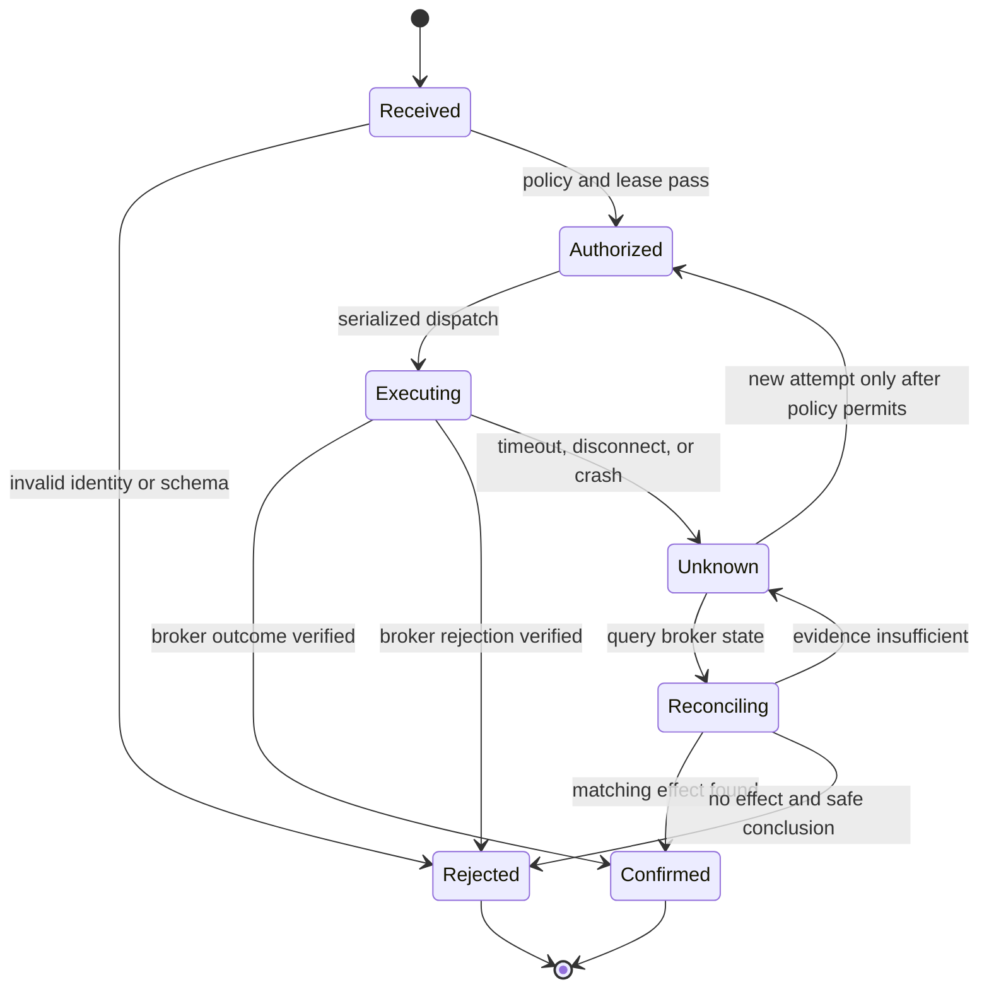

# Trading Safety Architecture

**Status:** Target safety contract. Current implementation has no production
trading command; see [baseline](IMPLEMENTATION_BASELINE.md).

## Independent state dimensions

Do not collapse these facts into one “online” state:

| Dimension | Meaning |
|---|---|
| Agent availability | Agent process/service can answer its own health/control checks. |
| Runtime readiness | Worker is available in the expected interactive identity/session. |
| MT5 connectivity | Terminal initialized and reports current terminal/broker connectivity. |
| Central connectivity | Agent has a current authenticated control-plane session. |
| Trading authorization | A specific command is authorized under current identity, lease and policy. |
| Existing-position protection | Permitted monitoring/reporting/protective operations for positions already open. |

Being available does not grant trading authority; being unauthorized for new
trades does not automatically mean positions should be abandoned.

## Policy layers and evaluation

Inputs: mandatory local safety controls; central risk policy; organization
policy; customer preferences; role permissions; account-specific constraints;
runtime/account state; and scoped approval/exception rules. Proposed evaluation:

1. Authenticate issuer and command audience; validate schema, expiry, IDs and
   idempotency key.
2. Bind command to tenant, Agent, account, Runtime and current execution lease.
3. Load a coherent, versioned effective policy. Record its revision and
   freshness; fail closed for new discretionary execution if required policy
   is unavailable or stale.
4. Apply mandatory local safety, then central risk, organization, customer,
   role, and account rules. More restrictive applicable controls prevail.
5. Only run an exception/approval path if that exact policy explicitly allows
   it, with authorized approver, scope, expiry and audit.
6. Check runtime/MT5 readiness and serialize the operation.
7. Record command state and return structured result; reconcile ambiguous
   state against broker observations before any retry.

This precedence is a proposed contract awaiting policy-engine design. A command
conflicting with a mandatory local restriction is rejected with a stable,
structured reason; the server cannot override the local control.

## Command classes

Authorization must be operation-specific:

| Class | Example | Default principle |
|---|---|---|
| Market data read | Read market symbols/data | Least privilege; bounded/read-only. |
| Account information read | Balance/equity/metadata | Sensitive read; explicit account scope and redaction. |
| New order | Open position/order | Strong identity, current policy, lease, risk checks, idempotency and fresh runtime. |
| Order modification | Change pending order | Re-authorize against current state and policy. |
| Stop-loss change | Modify protective level | Do not infer risk reduction; evaluate actual direction, exposure and policy. |
| Position close | Close/reduce position | Explicit permission and command intent; broker reconciliation. |
| Account switch | Change active trading account | Privileged state transition; stop new writes until account and lease confirmed. |
| Runtime administration | Restart Worker/terminal | Separate local management permission; must not imply trading authority. |

## Execution state and unknown outcome

An unknown result must not be silently marked failed or replayed. Reconcile
broker state first; if evidence remains insufficient, surface unresolved state
for an authorized operator/central workflow. The diagram's final transition
does not prescribe automatic retry; it means a fresh, separately authorized
attempt after reconciliation.

## Credit and connectivity behavior

Credit exhaustion can affect metering and authorization for new discretionary
commands under explicit policy. It must not be used as an authentication token,
and must not automatically halt existing-position monitoring or a permitted
protective action. Offline policy defines command classes that can continue,
limits, freshness windows and audit buffering; unresolved, do not assume
unbounded offline trading.

## Mission safety boundary

No real trades are executed for this documentation mission. Existing safe-read
tests and MT5 runtime smoke tests are not order-execution verification.
