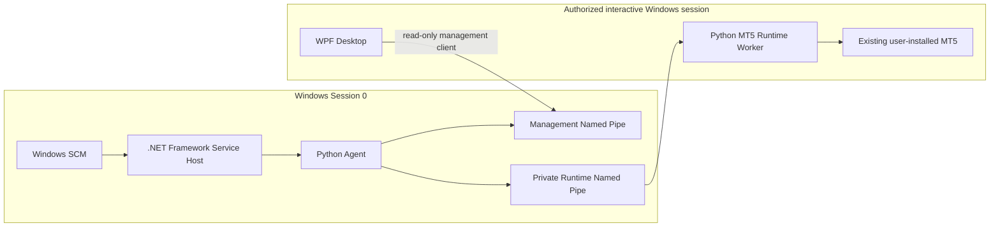

# MT5Agent v0.1.5 Release Readiness

**Status: PARTIAL — internal release candidate is not yet operationally validated.**

This record distinguishes source/CI evidence from product behavior observed on a
Windows installation. Pipeline success does not prove that the installed
Service starts in Session 0. No new Installer, Repair, Uninstall, manual
Service lifecycle action, snapshot operation, or trade is authorized by this
record.

## Architecture and lifecycle

The Desktop is a management client. It uses the Management pipe and has no
direct access to the private Agent-to-Worker pipe. The Service Host runs the
Python Agent in Session 0; the MT5 Worker and existing terminal remain in an
authorized interactive session. The Installer does not bundle or modify MT5.

## Acceptance evidence

| Gate | Status | Evidence and limitation |
|---|---|---|
| Agent executable path and sibling install layout | PASS (source + CI) | Service Host resolves `<install>\Agent\MT5Agent-v*.exe` from its `<install>\Service` directory. Pipeline #75 built the corrected candidate; this does not prove installed Session 0 startup. |
| Service Host startup diagnostics and child ownership | PASS (automated Windows test harness) | Existing lifecycle tests cover missing executable, invalid layout/SID, immediate exit, startup failure details, duplicate start, unexpected child exit, stop cleanup and owned Job Object behavior. These tests run a process harness, not SCM. |
| Product Service registration failure propagation | PASS (installer contract tests) | Required operation failure tests prevent success reporting when Service registration fails; Pipeline #75 passed. |
| SCM restart recovery policy | PENDING CI | This change configures two bounded restart attempts (5s, 15s), then no action, reset after 24h, and includes non-crash failures; read-back is required. Mocked success and failure paths were added. Real SCM verification remains pending. |
| Linux Python regression | PASS (Pipeline #75) | Existing Linux job passed. |
| Windows Python regression | PASS (Pipeline #75) | Existing Windows job passed. |
| WPF and Management IPC tests | PASS (Pipeline #75) | 42 C# tests and 23 IPC contract tests passed; deterministic cross-process management smoke passed. Does not test the installed product UI. |
| Live Worker/MT5 safe-read smoke | PASS (Pipeline #75, MT5 integration runner) | The existing authorized integration runner reported Worker ready and MT5 connected for safe-read checks. No real trade was executed. This does not validate the product Service installation. |
| Installer build and artifact verification | PASS (Pipeline #75; superseded by next candidate) | Build job #736 and verify job #737 passed. Artifact: `MT5Agent-Setup-v0.1.5-windows-x64.exe`, SHA-256 `633ebdf7f78cda3bdf22c59d23e21e3475ca4fe5a15a4bb8808f0190b64dea19`. This artifact predates the SCM recovery-policy change and is not the next candidate. |
| Real product Service startup in Session 0 | BLOCKED — separate authorization required | Pipeline #73 created the product Service, which crashed in `OnStart`; the installer correctly returned failure and rolled back the newly created Service. Pipeline #75 fixes the identified path mismatch but has not been installed/retested. |
| Installed Agent/Management pipe with product identity | NOT TESTED | Harness and candidate IPC tests do not prove product LocalSystem SID provisioning and pipe DACL after actual installation. |
| Product Worker provisioning and MT5 session integration | PARTIAL | Worker/MT5 safe-read smoke exists on the separate integration runner. Product Installer’s deployed Worker registration and actual service-to-worker connection were not exercised on the installation VM. |
| Installed WPF functional walk-through | NOT TESTED | CI build, ViewModel tests and deterministic IPC smoke are not a full interactive walk-through against the installed product. |
| Cold boot, recovery, crashes, RDP/logoff, soak and resource limits | NOT TESTED | No product lifecycle or stability thresholds were measured on the dedicated VM. |
| Windows 11 / Server 2022 / Server 2025 | DEFERRED — PRODUCT OWNER VALIDATION | Windows 10 evidence does not establish the other supported OS rows. |
| Signing and public distribution | BLOCKED | Current setup is an unsigned internal artifact. No public release is authorized. |

Pipeline #75 was for commit `0f7d2111084571b12a3526d37cc4ffba8bb6cc6c` and
passed 14/14 jobs. A new pipeline must pass after the recovery-policy changes;
its exact artifact hash and pipeline identity will supersede the older
artifact record above.

## SCM recovery behavior

The installer applies and reads back a bounded policy using Windows Service
Control Manager (`sc.exe failure`, `failureflag`, `qfailure` and
`qfailureflag`). It requests restarts after 5 seconds and 15 seconds, then no
action, with a 24-hour reset period. Non-crash service failures are included.
If application or read-back fails, Service installation fails and follows the
existing rollback boundary for a Service created during that attempt. The
recovery policy is not yet validated against the real Windows SCM on the
dedicated VM.

## Release gates and next action

Before approving a v0.1.5 release candidate, obtain a single scoped Product
Owner authorization for the final verified Pipeline artifact on
`win10-installer-test`. The current test VM may contain retained application
files from earlier failed installs; do not describe the next run as a clean
installation unless that state has first been explicitly reconciled. The
authorized run should execute the exact artifact once, observe Service
registration/startup and recovery configuration, and collect read-only
Management IPC, Worker, MT5-preservation and UI evidence. Do not manually
restart the Service or alter MT5 during that run unless separately authorized.

Commercial release additionally requires the OS matrix validation or explicit
deferral acceptance, signing, interactive UI and stability evidence, and a
separate release authorization. The current state is not release-ready.
