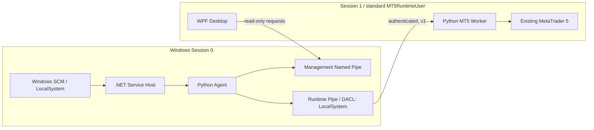

# MT5Agent v0.1.5 Release Readiness

**Status: PARTIAL — the Windows 10 integration runner passed a clean post-boot 15-minute Agent/Worker/MT5 health soak, but the manually installed artifact still has a verified health-reporting defect. Its source fix passed Windows tests but has no replacement artifact because the configured package mirror repeatedly timed out in CI.** Pipeline success does not prove correct installation or stable runtime behavior. This is an internal candidate assessment, not release approval.

## Architecture and lifecycle

```mermaid
flowchart LR
  subgraph S0[Windows Session 0]
    SCM[Windows SCM / LocalSystem] --> Host[.NET Service Host]
    Host --> Agent[Python Agent]
    Agent --> Mgmt[Management Named Pipe]
    Agent --> Runtime[Runtime Pipe / DACL: LocalSystem]
  end
  subgraph Interactive[Session 1 / standard MT5RuntimeUser]
    UI[WPF Desktop] -->|read-only requests| Mgmt
    Worker[Python MT5 Worker] --> MT5[Existing MetaTrader 5]
  end
  Runtime -->|authenticated, v1| Worker
```

The Service starts the Agent in Session 0. The Management pipe serves only the
configured callers and read-only operations. The Worker and existing MT5
terminal run under the standard interactive runtime account. Runtime settings
are machine-local; the Worker pipe authorizes the actual LocalSystem Service
identity. No MT5 installation, profile, account or credential is managed by the
Installer.

## Acceptance evidence

| Gate | Result | Evidence / limitation |
|---|---|---|
| CI baseline | **PASS** | Pipeline #84 passed 14/14 jobs; Build #862 and Verify #863; commit `91d5f6b47181375dc76975ebf61081746d0d136b`. |
| Pipeline #84 artifact | **PASS** | Installer/manifest/sidecar match; Ubuntu and Windows SHA-256 `2606c179c2744cddda54915140f264029adac1a35c9b372596a586192d1927de`; 9 installed components match Job #862. |
| Installer exit contract | **NOT RECORDED** | Product Owner manually installed the artifact; the Installer PID and numeric Exit Code were not captured. We did not rerun Pipeline #84 Setup. |
| Service registration / Session 0 | **PASS** | `MT5Agent` Automatic, LocalSystem, Running. Initially PID 4088 (Agent 7236/7016), after controlled restart PID 2368 (Agent 8092/6544), and after VM power-on PID 2940 (Agent 3560/3696) were all observed in Session 0. |
| SCM recovery | **PASS** | Live readback: restart at 5 s and 15 s, 86,400 s reset, non-crash failures enabled (`TRUE`). |
| Runtime identity / pipe ACL | **PASS for tested boundary** | RuntimePrincipal is standard `MT5RuntimeUser`; ControlPrincipal migrated reversibly to LocalSystem using the packaged supported script. Administrator and RuntimeUser negative access attempts were denied; a LocalSystem health probe succeeded. |
| Worker / MT5 health | **PASS for initial Worker-only soak** | 32/32 health samples over 15m34s; Worker PID 6852 and MT5 PID 7944 stayed in Session 1, one Worker process, connected/initialized, terminal build 6249. Safe version and symbol-count reads passed. |
| Agent↔Worker↔MT5 | **PASS for tested live path** | The original clean soak passed 32/32 over 15m35s. After VM power-on, a second soak passed 32/32 fresh `MT5_CONNECTED` samples over 15m34s. Current Worker PID 6276 and terminal PID 7308 remained in Session 1 under `MT5RuntimeUser`, with the terminal parented by the Worker. Safe terminal version and symbol-count reads passed earlier. The earlier reconnect-exhausted interval after Worker API shutdown/restart is retained as a separate non-clean run and risk. |
| Management authorization | **PASS for tested boundary** | Authorized Administrator `status.get` succeeded; RuntimeUser access to Management and Administrator access to the Worker pipe were denied with WinError 5. The Service's LocalSystem identity was authorized for Worker IPC/health, not Management `status.get`. Contract probes as LocalSystem returned structured `TIMEOUT` and `UNSUPPORTED_OPERATION` for `service.restart`. Unsupported Worker `order_send` was rejected as `IPC_UNSUPPORTED_OPERATION`; no trade occurred. |
| Service restart preservation | **PASS** | Controlled Service restart returned to Running as LocalSystem/Automatic, with a fresh connected Management response. Service PID changed 4088→2368; Worker PID 7032 and MT5 PID 7944 were preserved. |
| Health contract | **FAIL in installed artifact; source fix pending deployment** | Installed Pipeline #84 reports `worker_session_id: null` despite live Worker Session 1. Regression fix is committed as `a5b8a6f4f872af019450e9f94100edda41083899`. Pipelines #85–#87 did not produce a replacement artifact because the configured package mirror timed out fetching Pillow. |
| CI for health fix | **FAIL — infrastructure** | Pipeline #85 Windows tests and WPF Management passed; its Windows and Worker builds failed on mirror timeouts. Pipelines #86 and #87 passed Windows tests, WPF Management, and Desktop package verification; Linux tests failed before test execution on the same mirror timeout, so downstream build/Installer jobs were skipped. No quality gate or package source was changed. |
| Logs / event review | **PASS for observed window** | One informational MT5Agent Application event and one SCM Information event after installation/configuration; no matching .NET Runtime/Application Error or MT5Agent error event found. Logs redact SIDs and expose fixed messages. |
| WPF on integration runner | **NOT TESTED** | Two existing Desktop processes were observed in Session 1; neither was launched or closed by this validation. |
| Windows 11 / Server compatibility | **NOT TESTED** | Live product evidence is Windows 10 Pro x64 build 19045 only. |
| RDP/logoff, Worker-unavailable injection | **NOT TESTED** | These tests were not performed to preserve the active session and MT5 runtime. |
| Public release / signing | **BLOCKED** | Internal unsigned artifact; no release, tag, or merge to staging/main. |

Detailed live evidence is in
[`win10-mt5-runner-runtime-integration-20261013.md`](../evidence/v0.1.5/win10-mt5-runner-runtime-integration-20261013.md).
Raw evidence remains under
`C:\MT5Agent-Test\Evidence\RuntimeIntegration-Pipeline84-Install-20261013-151000\`.

## Release decision

The candidate is **not release-ready**. Pipeline #84 is the verified installed
build. After the operator powered the VMs on, the Service and Agent ran in
Session 0 alongside the existing Worker and MT5 terminal in Session 1; the
fresh 15-minute post-boot soak passed 32/32 samples. The earlier controlled
Service restart also preserved Worker and terminal PIDs. The earlier reconnect
transition remains recorded. The current artifact still omits the authenticated
Worker session number from Management health. The source fix is committed, but
Pipelines #85–#87 did not produce a new Installer because the configured
package mirror was unreachable. Restore that mirror, run the unchanged quality gates,
verify a fresh artifact and install that exact artifact before accepting the
health fix operationally. Then repeat the 15-minute soak with the fixed binary.
Keep Windows 11, Windows Server, RDP/logoff, WPF-on-runner and public signing
gates open until real evidence exists.
