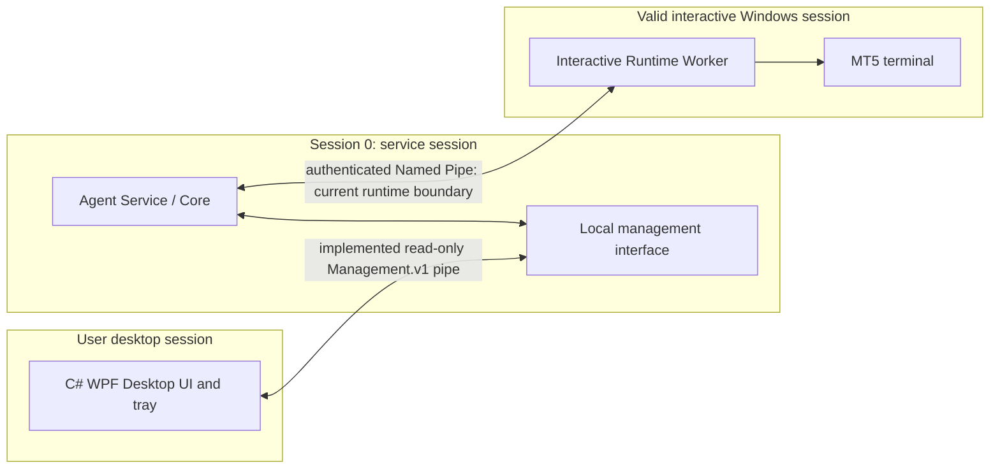
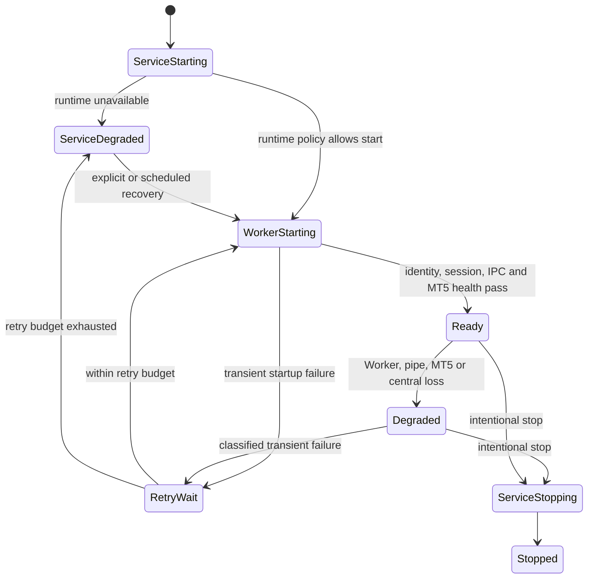

# Windows Service and MT5 Runtime

**Status:** Existing split-session runtime is accepted and lab evidenced.
Option A means WPF v0.1.4 requires an already installed and provisioned Agent/
Runtime, not a new commercial Service installer. Service/UI lifecycle details
below are target/proposed, not current productized behavior. See [existing runtime record](../MT5_RUNTIME_ARCHITECTURE.md)
and [accepted ADR-001](../ADR/ADR-001-unattended-mt5-runtime-hosting.md).

## Three independent processes

## Desktop UI process and tray lifecycle — Phase 4

The WPF client starts without probing or starting the Agent. Dashboard and
Runtime status requests use only the authorized Management Pipe; failures are
shown as offline/unavailable while the UI stays open. Local Windows/target
framework diagnostics remain available without the pipe. Settings are per
Windows user under that user's LocalAppData and do not write machine Service
configuration.

The notification-area icon owns only UI visibility. Minimize hides the window;
the configured Close to Tray option hides it on window close. The tray offers
Open/restore and explicit Exit. Exiting disposes the C# notification icon and
WPF resources, but never sends Service/Worker stop requests. Agent connectivity
notices are limited to connection transitions, honor the user preference and
are rate-limited. Startup registration is currently unsupported.

Runtime identity, process ID, and Windows session are not in the current
Management status projection and are shown as unavailable by the Runtime page.
The UI does not infer them or open the Worker pipe. Runtime restart and Service
control are not implemented.

Interactive Windows 10 x64 evidence: UI Automation reached the Dashboard,
Runtime, Settings, Logs, Diagnostics and About pages and changed themes in
console Session 1. The WPF window was captured on the active desktop. A
minimize/close-to-tray process-retention check passed. Tray icon rendering was
observed in the Windows notification-area overflow. The round trip from tray
activation to restored window and Exit context-menu action is still a release
gate. See the Phase 4 validation record in
[Implementation Baseline](IMPLEMENTATION_BASELINE.md).

The Session 0 Agent does not own the GUI-dependent MT5 API connection. The
Worker and terminal run in a valid nonzero interactive session under a distinct
runtime principal. The UI is independently started and never calls the
Worker's internal pipe. Closing/crashing UI must not stop Service or Worker.
Service can remain alive in degraded state when the Worker or MT5 is absent.

## Existing behavior versus product target

**Current implementation:** Windows composition selects
`RuntimeWorkerMT5Adapter`; HKLM `SOFTWARE\MT5Agent\Runtime` supplies runtime
principal and optional pipe configuration. Existing Phase 4D evidence documents
Session 0 Agent → authenticated Named Pipe → interactive Worker/MT5, including
an unattended cold-boot lab topology with local Autologon plus an
`AtLogOn` task. Agent can report degraded runtime. This does not prove a
customer-ready Service installer, UI startup, RDP disconnect recovery, or
general support matrix.

**Phase 2 addition:** the Agent host now composes a separate
`MT5Agent.Management.v1` read-only Named Pipe alongside its existing HTTP
listener when `MT5_AGENT_MANAGEMENT_ALLOWED_SIDS` is nonempty. An empty
allowlist disables it. It exposes protocol negotiation and verified status
projection only; the Dashboard never connects to the Worker pipe or `/command`.
The actual Windows token SID/DACL and Session 0 to Session 1 primitives passed
an isolated security spike. The end-to-end C# client used a synthetic Python
status host, not the installed product Service or live MT5. See
[Implementation Baseline](IMPLEMENTATION_BASELINE.md).

**Phase 3 integration:** the Management Pipe remains hosted by the same
`CompositeHostingPort` lifecycle as the Agent HTTP host and is shut down when
that host exits. A successful `status.get` proves the Agent process responds;
Windows Service state is currently `UNKNOWN` because no SCM observer is
implemented. Worker availability is true only after a valid authenticated
Worker health response and is cleared on Worker IPC failure. The Dashboard
reports its own Management Pipe connectivity separately. Pipeline 43 passed a
deterministic Agent lifecycle fixture and a second cross-process run through
the candidate Agent, authenticated Worker and live MT5 read-only health path.
The .NET client observed `AGENT_RUNNING`, `WORKER_READY`, `CONNECTED`, and
fresh status in Session 0; IPC round-trip was 90 ms for one sample. This does
not constitute installed Windows Service lifecycle or interactive WPF
validation. No management IPC operation controls Service, Worker, terminal or
trading behavior.

**v0.1.4 Option A:** consume an already installed/provisioned Agent and
Runtime. WPF starts independently in the interactive user's session. The
current Dashboard displays Service state as `UNKNOWN` because SCM observation
is not implemented; it does not install or provision the Service, create runtime accounts, or set up
Autologon. Close/crash of UI never stops Service or Worker. If an authorized
operator restarts Service, use standard SCM/UAC; the UI must still operate when
SCM denies access.

**Future target:** automatic Service installation/recovery and profile-aware
Worker supervision remain later work. Runtime account may be pre-existing or
customer-approved dedicated account only in a future installer scope. Creating
an account does not create an interactive session. Autologon, credential
storage, account rights, bootstrap and removal require explicit security review.

## Startup profiles

| Profile | Intent | Recovery expectation (proposed) |
|---|---|---|
| Personal Desktop | User-operated PC; service available even if UI closed | Service starts at boot; runtime starts only under configured user/session policy; explain logoff and user-session dependency. |
| Dedicated VPS Runtime | Stable MT5 session independent of an RDP client | Supported nonzero session at boot; RDP disconnect must not be treated as logoff; validate actual Windows Server/VPS policy. |
| Enterprise Managed | Centrally provisioned identity, update and policy | Admin-managed service/runtime principals, change windows, audit, approved recovery and support policy. |

Profiles describe future Agent/Runtime operations, not v0.1.4 installer options.
The approved commercial UI matrix is exactly Windows 10 x64, Windows 11 x64,
Windows Server 2022 x64, and Windows Server 2025 x64. On Server, require
**Desktop Experience**; Server Core has no standard GUI desktop and is out of
scope. All other Windows versions are unsupported for the commercial UI.

Windows 10 remains in the Product Owner-approved matrix but Windows 10 22H2
reached end of general support on 2025-10-14. Record edition/build and active
security servicing/ESU separately at release. This lifecycle risk does not
silently change the approved OS list. See [Quality Gates](QUALITY_GATES.md).

## Lifecycle and recovery

Classify each trigger before action:

| Event | Required treatment |
|---|---|
| Cold Boot | Order-independent readiness discovery; bounded startup retries; never equate delay elapsed with ready. |
| RDP disconnect | Distinguish disconnect from logoff; profile policy decides whether runtime remains valid; test on target Windows family. |
| User logoff | Interactive session ends; report degraded; start only in a newly authorized session. Do not silently impersonate another user. |
| Worker crash | Record exit and owned identity; bounded backoff; do not broadly kill terminals or launch duplicate Worker. |
| MT5 crash | Distinguish terminal failure from Worker failure; recovery requires ownership checks and configured policy. |
| IPC failure | Bounded reconnect; no assumption that a timed-out operation was cancelled. |
| Windows restart | Recover from persisted machine config; revalidate principal, session, lease and runtime readiness. |
| Server disconnection | Keep Agent/runtime status available; apply explicit offline authorization limits; buffer bounded audit/outcomes. |
| Intentional Service stop | Mark desired state stopped; suppress failure restart until explicit start/policy transition. |

**Proposed retry rule:** exponential backoff with jitter, bounded attempts/time,
reset only after stable health, and a clear exhausted/degraded state. Distinguish
intentional stop from unexpected failure in durable desired-state/reason data.
Exact values and whether Windows SCM or Agent supervisor owns each restart are
Open Decisions. Do not have two supervisors race to restart the same process.

## Session and test matrix

Validate cold boot without RDP, console sign-in, lock/unlock, RDP disconnect,
logoff, worker crash, terminal crash, IPC loss, service stop/restart and central
loss on each supported OS/profile. Test that UI exit never affects Core/Worker,
and UI can show service-offline diagnostics if SCM denies start. Never broadly
terminate `terminal64.exe`; track process identity, parent/session and ownership.

The Desktop Client process runs as the signed-in Windows user, not elevated by
default. It connects only to the dedicated management pipe. The Python Agent
Service stays under its configured Service principal; Runtime Worker/MT5 stay
under the runtime principal in a nonzero interactive session. Multiple logged-
on UI sessions use distinct SIDs and user preference stores. Only explicitly
provisioned local SIDs/groups may connect to the management pipe. Session 0
CI tests do not count as interactive UI tests.

## Phase 5 runtime validation — 2026-10-08

**Status: pending for installed-Service and multi-session acceptance.** The
authorized Runner inventory contains two Windows 10 Pro 22H2 x64 hosts. A
read-only service inventory found no MT5Agent Agent Service on either host.
The MT5 Runner has Python and `terminal64` processes in Session 1, but that does
not establish service registration, service startup, Management Pipe ownership,
or recovery behavior. No process was stopped, restarted or reconfigured.

Therefore Phase 5 has not validated Service start/stop, Worker independence
under an installed Service, Windows restart, RDP disconnect/reconnect, logoff,
multi-user behavior, or runtime failover. These remain release-blocking
acceptance items. The complete authorized-host inventory and OS gaps are in the
[Windows compatibility matrix](WINDOWS_COMPATIBILITY.md). The Phase 4
interactive session evidence remains historical and must not be represented as
a Phase 5 revalidation.
