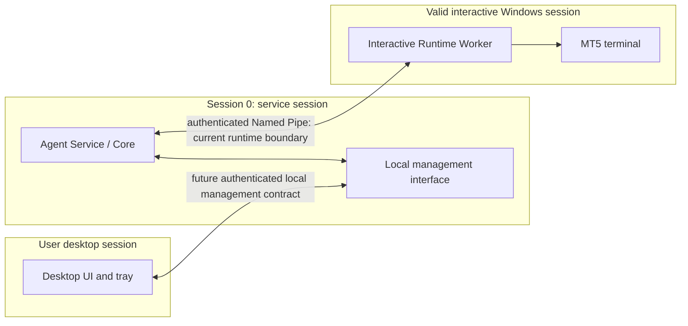
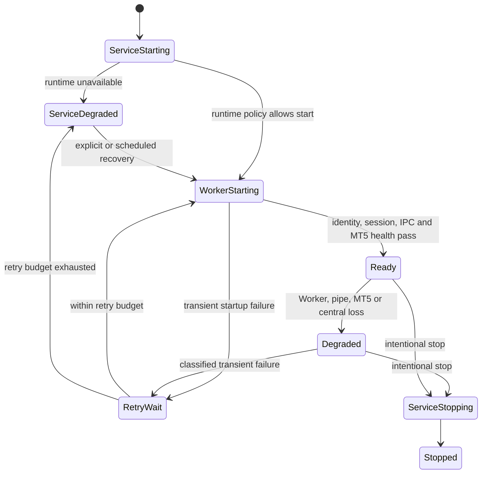

# Windows Service and MT5 Runtime

**Status:** Existing split-session runtime is accepted and lab evidenced.
Customer Service/UI lifecycle and startup profiles below are target/proposed
design, not current productized behavior. See [existing runtime record](../MT5_RUNTIME_ARCHITECTURE.md)
and [accepted ADR-001](../ADR/ADR-001-unattended-mt5-runtime-hosting.md).

## Three independent processes

The Session 0 Agent does not own the GUI-dependent MT5 API connection. The
Worker and terminal run in a valid nonzero interactive session under a distinct
runtime principal. The UI is independently started and never calls the
Worker's internal pipe. Closing/crashing UI must not stop Service or Worker.
Service can remain alive in degraded state when the Worker or MT5 is absent.

## Existing behavior versus product target

**Current implementation:** Windows composition selects
`RuntimeWorkerMT5Adapter`; HKLM `SOFTWARE\MT5Agent\Runtime` supplies runtime
principal and optional pipe configuration. Existing Phase 4D evidence documents
Session 0 Agent → authenticated Named Pipe → interactive Worker/MT5, including
an unattended cold-boot lab topology with local Autologon plus an
`AtLogOn` task. Agent can report degraded runtime. This does not prove a
customer-ready Service installer, UI startup, RDP disconnect recovery, or
general support matrix.

**Target:** automatically starting Windows Service, independently managed UI
and tray, profile-aware Worker supervision, bounded retry/backoff and explicit
service-manager recovery. Runtime account can be existing customer-approved
Windows account or installer-created dedicated account after explicit consent.
Creating an account alone does not produce an interactive MT5 session.
Autologon, credential storage, account rights, session bootstrap and removal
need explicit security review and customer approval.

## Startup profiles

| Profile | Intent | Recovery expectation (proposed) |
|---|---|---|
| Personal Desktop | User-operated PC; service available even if UI closed | Service starts at boot; runtime starts only under configured user/session policy; explain logoff and user-session dependency. |
| Dedicated VPS Runtime | Stable MT5 session independent of an RDP client | Supported nonzero session at boot; RDP disconnect must not be treated as logoff; validate actual Windows Server/VPS policy. |
| Enterprise Managed | Centrally provisioned identity, update and policy | Admin-managed service/runtime principals, change windows, audit, approved recovery and support policy. |

Profiles are proposals, not installer options implemented today. Installer
must let customer choose an existing runtime account or explicitly approve a
dedicated account. It must show session and credential implications and allow
recovery/uninstall. Windows 10 x64 is conditional on security/support policy;
Windows 11 x64 and selected Server x64 require compatibility validation.
Windows 7 is legacy testing only, not a new UI target.

## Lifecycle and recovery

Classify each trigger before action:

| Event | Required treatment |
|---|---|
| Cold Boot | Order-independent readiness discovery; bounded startup retries; never equate delay elapsed with ready. |
| RDP disconnect | Distinguish disconnect from logoff; profile policy decides whether runtime remains valid; test on target Windows family. |
| User logoff | Interactive session ends; report degraded; start only in a newly authorized session. Do not silently impersonate another user. |
| Worker crash | Record exit and owned identity; bounded backoff; do not broadly kill terminals or launch duplicate Worker. |
| MT5 crash | Distinguish terminal failure from Worker failure; recovery requires ownership checks and configured policy. |
| IPC failure | Bounded reconnect; no assumption that a timed-out operation was cancelled. |
| Windows restart | Recover from persisted machine config; revalidate principal, session, lease and runtime readiness. |
| Server disconnection | Keep Agent/runtime status available; apply explicit offline authorization limits; buffer bounded audit/outcomes. |
| Intentional Service stop | Mark desired state stopped; suppress failure restart until explicit start/policy transition. |

**Proposed retry rule:** exponential backoff with jitter, bounded attempts/time,
reset only after stable health, and a clear exhausted/degraded state. Distinguish
intentional stop from unexpected failure in durable desired-state/reason data.
Exact values and whether Windows SCM or Agent supervisor owns each restart are
Open Decisions. Do not have two supervisors race to restart the same process.

## Session and test matrix

Validate cold boot without RDP, console sign-in, lock/unlock, RDP disconnect,
logoff, worker crash, terminal crash, IPC loss, service stop/restart and central
loss on each supported OS/profile. Test that UI exit never affects Core/Worker,
and UI can show service-offline diagnostics if SCM denies start. Never broadly
terminate `terminal64.exe`; track process identity, parent/session and ownership.
