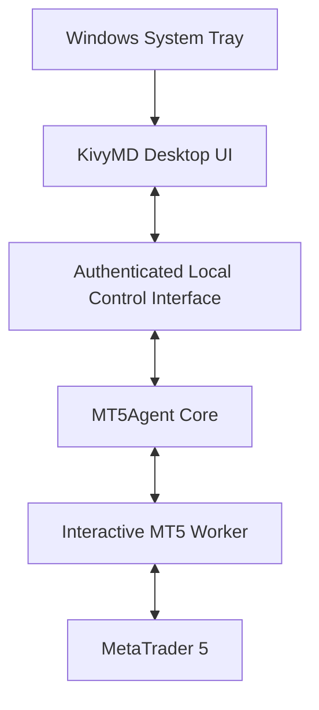

# v0.1.4 Desktop UI — Product and Architecture Plan

**Status:** planning record only. This document does not authorize
implementation, establish a v0.1.4 release scope/date, or change the released
v0.1.3 product.

## Decision labels

- **CONFIRMED PRODUCT DECISION** records the direction agreed for planning.
- **PROPOSED DESIGN** records a capability or approach to evaluate before
  implementation approval.
- **OPEN ENGINEERING QUESTION** needs evidence or a design decision.
- **OUT OF SCOPE** is excluded from v0.1.4 client-side planning.

## Baseline and repository findings

- **CONFIRMED PRODUCT DECISION:** v0.1.3 is released. Its Agent/control plane
  runs in Windows Session 0, while the persistent MT5 Runtime Worker and
  terminal run in a nonzero interactive session. The Agent communicates with
  the Worker over an authenticated local Named Pipe. See
  [runtime architecture](../ARCHITECTURE.md) and the
  [v0.1.3 release record](../releases/v0.1.3-release-notes.md).
- The Agent can remain alive with degraded health when the Worker is
  unavailable. Current status and health commands expose Agent/runtime state;
  a connected MT5 state requires a live Worker health response. Cached or
  inferred UI state must not be presented as a current measurement.
- Current Agent configuration is loaded from environment variables for the
  loopback HTTP host/port/request limit and log level/file. There is no active
  customer server URL, username/password, general configuration-file loader,
  or credential-store integration. Windows Worker policy comes from
  machine-local registry configuration.
- The current HTTP adapter serves `/command`; the default composition does not
  configure authentication or authorization providers. It is not an approved
  Desktop UI control API. The Windows Named Pipe is specifically the
  Session 0-to-Worker boundary and must not be exposed to the UI without a new
  authorization design.
- Logging currently accepts DEBUG, INFO, WARNING, and ERROR and writes
  fixed/sanitized lifecycle messages. File logging is append-only and does not
  implement rotation or retention. TRACE, a UI log viewer, export, and
  diagnostic bundles do not exist.
- No Kivy/KivyMD dependency or desktop/tray package is declared in the current
  project metadata. The Windows startup lab uses automatic interactive logon
  and an `AtLogOn` task for the Worker. It is not a productized Agent service,
  UI startup, or tray lifecycle.
- The v0.1.3 post-release validation record documents an initial runtime smoke
  failure with unknown cause followed by a successful retry. Worker startup
  reliability therefore remains an evidence item; this UI plan does not
  reinterpret that history.

## Product decisions and scope

### Desktop UI and independent execution

- **CONFIRMED PRODUCT DECISION:** plan a Windows desktop graphical interface
  using KivyMD, contingent on a compatibility, accessibility, and packaging
  feasibility check.
- **CONFIRMED PRODUCT DECISION:** the Agent must operate independently of the
  UI. Closing, minimizing, or crashing the UI must not stop Agent Core or the
  MT5 Runtime Worker. The UI is for management and observation, not the runtime
  engine.
- **CONFIRMED PRODUCT DECISION:** desired customer experience is automatic
  Agent startup, continued execution without an open UI, independent UI
  open/close, and a system tray entry for quick status and UI access. Tray
  failure must not affect Agent execution.
- **OPEN ENGINEERING QUESTION:** choose the Windows startup mechanism and tray
  process design that provide this experience safely. The tray implementation
  is not selected or present in the current repository.
- **OPEN ENGINEERING QUESTION:** choose startup and process ownership that
  work across Session 0 and interactive sessions, preserve Worker identity and
  startup constraints, recover after reboot, and do not depend on an RDP
  session. The lab Autologon/task sequence is evidence for its lab topology,
  not a customer installation decision.

### Client-side scope

- **CONFIRMED PRODUCT DECISION:** v0.1.4 UI planning is client-side only.
- **OUT OF SCOPE:** Kubernetes namespaces, central management services,
  server-side APIs, central web dashboards, server-side databases, and central
  monitoring infrastructure. A future web management center remains a
  separate initiative and must not expand this client release's scope.
- **OPEN ENGINEERING QUESTION:** a requested UI capability may depend on an
  existing server endpoint. Verify that endpoint and its contract before
  claiming support; otherwise document a local-only or deferred behavior.

## Proposed UI sections

### Dashboard

**PROPOSED DESIGN:** show Agent running/stopped/degraded, server connection,
authentication, MT5 terminal connection, interactive Worker health, last
successful communication, installed version/build, important warnings/errors,
and basic runtime diagnostics.

Every status item should include its source and freshness. Show separately:

- live observations returned by a successful current probe;
- last known/cached observation with its timestamp;
- inferred state and the evidence/rule used to infer it;
- unavailable/unknown when no reliable measurement exists.

An Agent process being alive does not establish Worker or MT5 readiness. A
stale successful response must not be labeled connected.

### Connection and authentication

**PROPOSED DESIGN:** provide customer fields for server URL/address, username,
password or a future supported credential flow, connection settings, and
customer-configurable Agent preferences. Provide **Test Connection**,
**Save Settings**, **Connect/Reconnect**, clear actionable errors, and
configuration validation.

Do not persist passwords in plaintext configuration or logs. Prefer a secure
credential/token lifecycle that avoids repeatedly storing and transmitting a
user password. Evaluate Windows Credential Manager and DPAPI, including which
Windows identity can read the secret, whether that identity is the Session 0
Agent account or interactive UI user, migration/rotation/revocation, backup,
and recovery behavior. Encryption under the wrong identity is not a usable
solution. No current customer authentication endpoint or lifecycle was found;
do not invent one.

Local settings must not override server-defined security or execution policy.
Configuration is validated before save/apply; invalid settings keep the
last-known-good active values and produce an explicit error. Test Connection
must not silently change the active connection.

### Settings

**PROPOSED DESIGN:** group settings under Connection, Authentication, Startup
behavior, UI preferences, Theme, Language, Logging, Diagnostics,
Notifications, and Advanced settings.

Do not add configuration keys until each is traced to an existing contract or
approved design. Classify each eventual setting as:

| Change class | Expected behavior |
| --- | --- |
| UI-only preference | Apply immediately; must not restart or change Agent runtime. |
| Safe runtime preference | Apply atomically after validation; retain last-known-good on failure. |
| Connection/authentication | Apply only after validation and explicit reconnect; report the active revision. |
| Startup/process identity, Worker policy, or hosting | Require an approved restart/provisioning workflow; UI cannot silently change privileged machine policy. |

Exact settings, bounds, persistence location, and ownership remain open until
the existing configuration and server policy contracts are audited.

### Logs and diagnostics

**PROPOSED DESIGN:** a user-facing viewer with severity filters, text search,
time-range selection, source filtering, export, diagnostic-bundle generation,
and plain-language error descriptions. Proposed levels are ERROR, WARNING,
INFO, DEBUG, and TRACE for temporary advanced diagnostics only.

Verbosity never weakens secret redaction or privacy rules. Define bounded log
rotation, retention, and disk budgets before enabling persistent UI logs.
Diagnostic bundles must be sanitized, clearly previewable, and require user
review and consent before transmission. Export should state the selected time
range and sources. A failed or partial collection must be identified as such.
No remote transmission is implied by a local export feature.

### Feedback and support

**PROPOSED DESIGN:** a Feedback Center for bug reports, feature requests, UX
feedback, and support requests; optional attachments and sanitized diagnostic
bundles; submission status; and local pending/submitted history where
feasible.

Represent each item with a structured, versioned data model that can later
support analysis. Future LLM use may categorize, find duplicates, cluster
issues, analyze sentiment/themes, extract feature ideas, and recommend product
improvements. LLM processing is future work, not v0.1.4 implementation.
Feedback content and attachments are untrusted data and must never be executed
or treated as instructions.

Distinguish these states in UI and documentation:

1. A local feedback form and locally persisted draft.
2. Submission through an already existing, verified endpoint, only if its
   contract, authentication, privacy, and response are confirmed.
3. Future server-side feedback infrastructure, which is not authorized here.

No supported submission endpoint was identified in the repository. Until one
is verified, do not label local save as submitted or claim end-to-end delivery.

### About and updates

**PROPOSED DESIGN:** display installed Agent version/build, documentation and
release links, and support information. Show update availability only when a
supported mechanism exists. Automatic software updates are not an approved
requirement. Existing update-policy code is a foundation and is not proof of a
production update service.

## Theme direction and accessibility

These are **design preferences**, not a completed design system.

| Token | Preferred dark: Midnight Terminal | Future light: Light Professional |
| --- | --- | --- |
| Background | `#0B1220` | `#F8FAFC` |
| Surface | `#172235` | `#E2E8F0` |
| Primary | `#38BDF8` | `#2563EB` |
| Success | `#22C55E` | `#059669` |
| Warning | `#F59E0B` | `#D97706` |
| Error | `#F87171` | `#DC2626` |

**CONFIRMED PRODUCT PREFERENCE:** Midnight Terminal is the preferred initial
direction; theme implementation awaits the feasibility/design stage.

Validate text and control contrast against applicable accessibility targets.
Do not encode status by color alone: pair color with explicit text, icon/shape,
and accessible names. Use legible typography, keyboard navigation, visible
focus, scalable layouts and text, Windows display scaling, and layouts that
remain usable in compact windows. Verify Persian/right-to-left rendering if
Persian is offered as a UI language; language scope and translation ownership
remain open.

## Architecture and trust boundaries

The following is a **PROPOSED DESIGN**, not the current implementation:

The UI must not control the terminal directly or call privileged Worker IPC.
Investigate an authenticated local interface (or equivalent) with explicit
authentication/authorization, least privilege, input validation, safe
configuration updates, secret-free status responses, and no path around
trading safety rules. Validate behavior for different Windows users and
sessions. The current `/command` HTTP composition has no configured authn/authz
provider by default and is not approved for this use. The Named Pipe exists at
the Agent-to-Worker boundary and has a different caller policy; do not simply
grant UI access to it.

Keep UI operations nonblocking. Define timeouts, cancellation, reconnect
behavior, stale-data rules, and safe restart ownership. UI/tray crashes must be
isolated from Core and Worker process lifecycles. A UI restart must discover
the running Agent rather than accidentally launching a second Worker or
terminal.

## v0.1.4 planning stages and measurable exit criteria

The stages below are **PROPOSED planning gates**, not approved implementation
tasks. Each gate needs recorded evidence and a separate decision to proceed.

| # | Stage | Measurable exit criteria |
|---:|---|---|
| 1 | Existing architecture and dependency audit | Inventory each requested screen field against a code contract, live source, cache, or unavailable state; document process identities/sessions, configuration ownership, endpoints, auth providers, log sources, and absent features. Every claimed existing capability has a source reference; unsupported claims are removed. |
| 2 | KivyMD compatibility and packaging proof of concept | Build a Windows proof of concept on the supported Python/Windows matrix; record exact Kivy/KivyMD and packaging versions, startup time, installer/package size, native dependency/licensing review, clean-machine launch, and scaling/accessibility findings. Pass/fail thresholds and matrix are approved before execution. |
| 3 | UI/Core separation and local interface design | Threat model and protocol specify caller identity, authorization, allowed operations, validation, secret redaction, timeouts, versioning, and error schema. Demonstrate unauthorized local users/processes cannot read or mutate protected settings; no Worker IPC or trade policy bypass exists. |
| 4 | Dashboard and health reporting | For each dashboard datum, tests/probe evidence identify live, cached, inferred, or unknown state and show a timestamp/freshness limit. UI reflects Agent, Worker, and MT5 independently; disconnect/offline simulations show degraded/unknown rather than false healthy. |
| 5 | Secure connection configuration | Validation rejects malformed URL/credentials/settings without replacing last-known-good values. Test Connection is non-mutating. Credentials are absent from config/logs/exports and readable only by the approved runtime identity; rotation/revoke/recovery and invalid-server behavior are demonstrated. |
| 6 | Logs and diagnostics | Severity/search/time/source filters produce correct subsets on a large representative log set without UI blocking. Rotation, retention, and disk cap are demonstrated. Export and bundle fixtures prove secret/PII redaction; transmission remains blocked until explicit review/consent. |
| 7 | Feedback UI and local persistence | Drafts survive app close and reboot; schema version and migrations are documented. Offline submission remains pending and never displays delivered. Attachments are bounded/validated; any endpoint delivery claim is backed by a verified endpoint contract and observed response. |
| 8 | System Tray and startup behavior | Tray can open/status the UI and be terminated/restarted while Agent and Worker remain active. UI open/close is independent. Boot recovery is demonstrated without RDP login; Session 0 Agent and interactive Worker identities/session IDs satisfy the approved policy and no duplicate terminal/Worker appears. |
| 9 | Windows integration testing | On a declared Windows matrix, exercise reboot, no-RDP operation, Worker absent/restart, offline server, invalid settings, UI/tray crashes, credential access boundaries, log volume, feedback persistence, installer size, and uninstall/recovery. Capture pass/fail and event/process/session evidence without secrets. |
| 10 | Documentation and release acceptance | User/admin setup, identity/session model, privacy/retention, troubleshooting, support/export behavior, rollback/recovery, and known limitations are documented. All criteria have evidence and an explicit release owner decision; no stage is considered accepted from code presence alone. |

Numeric thresholds (startup latency, log cap/retention, package-size ceiling,
supported Windows/Python matrix, and health freshness window) are intentionally
not invented here. Stage owners must set and approve them before measuring.

## Open engineering questions

1. Which KivyMD/Kivy/Python combinations can be packaged and supported on
   customer Windows machines and VPSs, and what are their size/licensing/native
   dependency tradeoffs?
2. What Windows process/service/task owns the Agent across reboot, and how can
   the interactive Worker retain its required user identity/session without
   making Agent availability depend on RDP or UI login?
3. Should the tray run in the interactive user's context as a separate
   process, and how does it discover/manage an Agent in Session 0 securely?
4. What authenticated local-control transport works across Session 0 and
   interactive sessions while enforcing per-user authorization and bounded
   commands? Can the current boundary be extended safely, or is a new one
   required?
5. Which actual remote server endpoint and authentication/token lifecycle
   support customer connection settings? Which settings are local, server
   managed, or bounded by server policy?
6. Which principal stores and reads UI credentials if the UI and Agent run as
   different Windows accounts? Credential Manager vs DPAPI needs a concrete
   identity and recovery threat model.
7. What log sources, rotation policy, retention period, storage budget, and
   redaction checks are supportable on customer VPS disks?
8. Is there a verified feedback submission endpoint? If not, how long and where
   may local drafts be retained, and what does the UI say about submission?
9. What update mechanism, if any, is supportable? Automatic update is not
   approved by this plan.
10. What Windows, display scaling, keyboard accessibility, supported UI
    languages, and right-to-left acceptance matrix will be maintained?

## Explicit exclusions

- **OUT OF SCOPE:** implementing any desktop UI, tray process, startup
  integration, local-control API, credential store, feedback backend, or
  installer as part of this documentation change.
- **OUT OF SCOPE:** central APIs/services, web management center, central
  storage/monitoring, Kubernetes, and server-side feedback/LLM processing.
- **OUT OF SCOPE:** automatic software updates and any new trading/execution
  authority.
- **OUT OF SCOPE:** weakening the Windows Named Pipe ACL, Worker identity,
  interactive-session requirements, or server-defined security/execution
  policy to simplify UI integration.

## Phase 0 implementation contract (2026-10-08)

The evidence behind this update is recorded in the
[Phase 0 baseline and architecture report](../evidence/v0.1.4/phase0-baseline-and-architecture.md).
The implementation contract below turns the existing product direction into
sequenced work. It does not approve a release date or product scope beyond the
client-side planning already recorded above.

### Capability baseline

| Capability | v0.1.4 planning classification | Evidence / boundary |
|---|---|---|
| Dashboard | PARTIAL | Agent/Worker/MT5 health and diagnostics exist; no desktop UI. Each value must expose source and freshness as live, cached, inferred or unknown. |
| Status model | PARTIAL | `agent.get_status`, `agent.get_health`, and Worker inspection exist; no stable UI application API or freshness envelope. |
| Server settings | BACKEND_DEPENDENT | No active server URL, login or connection endpoint/configuration exists. Do not invent a target endpoint. |
| Credential security | MISSING | No user credential store is present. Define identity ownership and rotation/recovery before choosing Credential Manager or DPAPI. |
| Local settings | PARTIAL | Environment and machine registry configuration exist for runtime/HTTP/logging; there is no customer UI settings model or policy precedence contract. |
| Logs | PARTIAL | Safe fixed lifecycle logging exists; no TRACE, UI viewer, rotation, retention or export. |
| Diagnostics | PARTIAL | CLI `--diagnose --json` and runtime health exist; no desktop diagnostics bundle or freshness/source metadata contract. |
| Feedback | MISSING | No feedback UI, local draft store or verified submission endpoint. |
| About | MISSING | Version command and package metadata exist; no UI page. |
| Updates | DEFERRED | No updater. Automatic updates are excluded until a separate trust, signature and rollback design is approved. |
| Tray | MISSING | No tray process. Failure must remain isolated from Agent and Worker lifecycles. |
| Startup independence | PARTIAL | Lab Autologon and Worker Scheduled Task exist; no supported customer Agent/UI/tray installation lifecycle. |
| UI/Core API boundary | MISSING | Existing `ApplicationBoundary` is transport-neutral, but default authorization is allow-all and HTTP `/command` is not an approved UI interface. Introduce a narrow, authenticated local application API. |
| Central management readiness | PARTIAL | Contracts and remote-configuration foundations exist but are not in the active production request path. Define seams and policy precedence; backend/enrollment remain deferred. |
| Hybrid concurrency | PARTIAL | HTTP uses per-request threads; Worker/MT5 work is serialized. A bounded scheduler exists but is not composed into the active path. |
| Windows packaging | PARTIAL | CI builds and tests a PyInstaller executable; no desktop UI/tray installer, signing, upgrade or customer recovery flow. |

### Architecture boundaries to preserve

- Keep the current Session 0 Agent/control plane independent of the interactive
  UI. UI close/crash and tray failure must not stop the Agent or Worker.
- Add a small UI-facing application service/port for health, settings,
  diagnostics and approved user actions. Do not expose internal Worker classes
  or reuse the Session 0-to-Worker Named Pipe as a UI API without a separate
  authorization review.
- Keep the Worker as the only owner of the MetaTrader5 Python API. Serialize
  MT5 calls until thread-safety is established with vendor evidence and
  targeted tests. Use bounded admission and explicit cancellation/backpressure
  for any new concurrent work.
- Model future central management with explicit Agent identity, enrollment,
  authentication, versioned configuration, local/remote precedence, command
  authorization, audit, capabilities, offline behavior and revocation seams.
  Do not implement the management service or enrollment in v0.1.4.
- Treat settings as validated inputs. Preserve last-known-good values on failed
  updates. Secrets must not enter ordinary configuration, logs, diagnostics,
  feedback or crash bundles; define which Windows identity can read them.
- Preserve the release rule **Build Once -> Test Same Artifact -> Release Same
  Artifact**. The exact packaged executable accepted by smoke tests must be the
  executable released; release publication must consume package-job artifacts,
  never rebuild after acceptance.

### Proposed v0.1.4 test matrix

| Test class | Required environment | Gate / result |
|---|---|---|
| Unit | Linux | Required source/contracts, configuration, state and pure UI-model tests. |
| Core integration | Linux and Windows as appropriate | Required composition, diagnostics and local adapters; no trading. |
| Windows Core | Windows without MT5 | Required control-plane and package isolation tests. |
| UI unit/component | Windows with mocks/fakes | Required view-model, freshness labels, settings validation, redaction and error-state tests. |
| UI smoke | Interactive Windows desktop | Required launch/render/input/shutdown smoke; current Session 0 runners do not establish desktop readiness. |
| Packaging | Windows | Build the one release candidate; inspect package and dependencies. |
| IPC integration | Windows | Required ACL, principal/session, framing, timeout, reconnect and malformed-peer checks. |
| Runtime integration | Windows + interactive Worker | Required lifecycle, degraded/recovery and no-RDP checks using read-only operations. |
| MT5 integration | Windows + real MT5 | Read-only health/version/symbol/account-presence checks only; no order submission or account values in evidence. |
| Cold boot | MT5 Windows VM | Verify automatic supported startup without RDP/console login and no duplicate processes. |
| RDP disconnect | MT5 Windows VM | Verify runtime policy and health while a session disconnects/locks; record actual supported behavior. |
| Concurrency/load | Windows | Exercise bounded HTTP admission, Worker serialization, fairness, timeouts, shutdown and backpressure. |
| Release artifact smoke | Same artifact intended for release | Consume the packaged artifact by hash; no independent rebuild between acceptance and release. |

The current CI already distinguishes Linux tests, Windows without MT5, and
Windows with MT5. It has no UI component/smoke gate or confirmed interactive
desktop runner. No release pipeline has demonstrated a packaged Kivy/KivyMD
artifact; settle this in the spike before adding release dependencies.

### Implementation sequence and exit criteria

| Phase | Work and dependencies | Exit criteria |
|---|---|---|
| 1. Architecture and acceptance contract | Use the Phase 0 evidence to approve the v0.1.4 scope, freshness schema, local settings/policy precedence, UI application API, credential identity/threat model, startup/tray ownership and Windows support matrix. Draft ADRs for the UI/Core control boundary and credential/startup model where a decision changes a security boundary. | Every UI feature maps to an existing or approved contract; unknown/back-end-dependent items are excluded or explicitly bounded; nonfunctional thresholds and acceptance owners are set. |
| 2. Desktop UI compatibility spike and prototype | In an isolated branch/environment, pin a candidate Python/Kivy/KivyMD toolchain; prototype dashboard layout, accessibility/RTL/font scaling, tray feasibility and PyInstaller packaging on supported Windows. Measure startup, package size and native dependencies. | Reproducible Windows prototype installs/runs on the declared matrix; UI and tray failure do not affect core. Record evidence and only then decide whether to accept KivyMD in an ADR. |
| 3. Functional desktop client | Build UI against the narrow app API with explicit live/cached/inferred/unknown status, server/local settings boundaries, safe diagnostics/log display, About, and offline feedback drafts. Add credential integration only after Phase 1 identity decision. | UI actions are authorized and validated; core lifecycle is independent; credentials and diagnostic exports pass redaction/access tests; no invented server/update endpoint is presented as working. |
| 4. Hybrid concurrency hardening | Measure current request paths; put bounded admission/backpressure around concurrent ingress; retain one serialized MT5 lane; define timeout vs cancellation and graceful drain/restart behavior. Do not adopt asyncio or MT5 parallel calls without measured need and proof. | Load/failure tests show bounded resource use, deterministic rejection, no concurrent MT5 entry, defined cancellation semantics, and clean shutdown with in-flight work. |
| 5. Windows integration and packaging | Integrate selected Agent/UI/tray startup topology, supported interactive control, packaging/signing decisions, install/upgrade/uninstall and recovery. Run UI and runtime gates on purpose-provisioned Windows environments. | Cold boot, UI/tray crash, RDP disconnect, Worker recovery, credential boundaries and exact package smoke pass on the declared Windows matrix. |
| 6. Release readiness | Resolve all release automation blockers; stage authorization/risk review; verify HTTPS/TLS, token access, exact pipeline receipts, mirror reconciliation and artifact provenance without creating a test release. | Release owner and Maintainer review the final MR/risks; all required jobs and publication configuration are evidenced; same artifact hash is traceable end to end. |
| 7. v0.1.4 release | Only after Phase 6 approval, merge under protected controls, create the authorized protected stable tag and follow the existing fail-closed publication/reconciliation procedure. | Published release and downstream mirror read back the exact accepted tag, artifact size/hash, notes and provenance; no release rebuild occurs. |

**ADR candidates:** (1) UI-to-Agent local control and authorization boundary,
(2) supported Agent/UI/tray startup and identity model, (3) credential storage
principal and recovery lifecycle, and (4) concurrency admission/cancellation
contract if it changes the active architecture. KivyMD remains a spike result;
do not finalize a technology ADR before that evidence exists. The existing
[KI-009](../KNOWN_ISSUES.md#ki-009-time-synchronization-monitoring-and-persistence-follow-up)
records the v0.1.5 clock-skew backlog.
